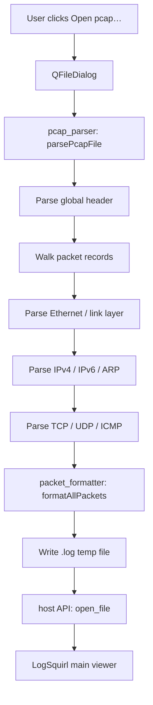

# logsquirl-tcpdump — tcpdump / pcap Viewer Plugin for LogSquirl

[](https://github.com/64x-lunicorn/LogSquirl-tcpdump/actions/workflows/ci-build.yml)
[](LICENSE)
[]()

A [LogSquirl](https://github.com/64x-lunicorn/LogSquirl) plugin that parses
`tcpdump` / libpcap capture files (`.pcap`, `.cap`, `.dmp`) and displays
them as human-readable text in LogSquirl's log viewer — similar to
Wireshark's packet list view.

## Features

- **pcap File Parsing** — Reads standard libpcap format files (big-endian
  and little-endian), with automatic text preamble scanning for `adb
  exec-out tcpdump` output
- **Protocol Dissection** — IPv4, IPv6, TCP, UDP, ICMP, ICMPv6, ARP
- **Application-Layer Detection** — TLS handshakes, HTTP requests/responses,
  DNS with domain name extraction, NMEA 0183 GPS sentences
- **Port-Based Protocol Hints** — SSH, FTP, SMTP, IMAP, MySQL, PostgreSQL,
  Redis, MongoDB, MQTT, AMQP, Kafka, ADB, and 20+ more
- **Stream Tracking** — Assigns conversation IDs based on IP+port 4-tuples
  so related packets can be filtered together
- **Smart Payload Preview** — Shows printable payload text, collapses binary
  runs, suppresses predominantly binary data
- **Link-Layer Support** — Ethernet, Raw IP, Linux cooked capture (v1 + v2),
  BSD loopback
- **Wireshark-Style Output** — Columns: No., Stream, Time, Source,
  Destination, Protocol, Len, Info
- **TCP Flag Display** — SYN, ACK, FIN, RST, PSH, URG in bracket notation
- **VLAN Support** — Strips 802.1Q VLAN tags transparently
- **Sidebar Panel** — Integrated sidebar tab with "Open pcap…" button,
  protocol breakdown with percentages and byte counts, top endpoints,
  capture duration, packets per second, and file size
- **Auto-Open** — Parsed output opens directly in LogSquirl's main viewer
- **Cross-Platform** — Works on macOS, Linux, and Windows

## Prerequisites

- **LogSquirl** ≥ 26.03 with the plugin system enabled
- **Qt6** (Core + Widgets) — same version LogSquirl was built with
- **CMake** ≥ 3.16
- A C++17-capable compiler (GCC ≥ 9, Clang ≥ 14, MSVC ≥ 19.29)

## Build

```bash
# Clone
git clone https://github.com/64x-lunicorn/LogSquirl-tcpdump.git
cd LogSquirl-tcpdump

# Configure
cmake -B build -S . -DCMAKE_BUILD_TYPE=Release

# If Qt6 is not in PATH (e.g. Homebrew on macOS):
cmake -B build -S . -DCMAKE_BUILD_TYPE=Release \
  -DCMAKE_PREFIX_PATH="$(brew --prefix qt6)"

# Build
cmake --build build

# The shared library is in build/:
#   macOS:   build/liblogsquirl_tcpdump.dylib
#   Linux:   build/liblogsquirl_tcpdump.so
#   Windows: build/logsquirl_tcpdump.dll
```

### Running Tests

```bash
cmake -B build -S . -DCMAKE_BUILD_TYPE=Release -DBUILD_TESTS=ON
cmake --build build
cd build && ctest --output-on-failure
```

## Install

Copy the plugin library **and** `plugin.json` into one of LogSquirl's
plugin search directories:

| Platform | Plugin Directory |
|----------|-----------------|
| macOS    | `~/Library/Application Support/logsquirl/plugins/io.github.logsquirl.tcpdump/` |
| Linux    | `~/.local/share/logsquirl/plugins/io.github.logsquirl.tcpdump/` |
| Windows  | `%APPDATA%/logsquirl/plugins/io.github.logsquirl.tcpdump/` |

```bash
# Example for macOS:
DEST="$HOME/Library/Application Support/logsquirl/plugins/io.github.logsquirl.tcpdump"
mkdir -p "$DEST"
cp build/liblogsquirl_tcpdump.dylib "$DEST/"
cp plugin.json "$DEST/"
```

## Usage

1. Open LogSquirl
2. In the sidebar, select the **tcpdump** tab
3. Click **Open pcap…** and select a `.pcap`, `.cap`, or `.dmp` file
4. The parsed packets will open as a text log in LogSquirl's viewer
5. Use LogSquirl's built-in search, filters, and highlighters on the
   packet data

## Example Output

```
No.    Stream Time           Source                                  Destination                             Protocol  Len    Info
1      1      0.000000       192.168.1.100                           10.0.0.1                                TCP       54     443 → 54321 [SYN] Seq=0 Ack=0 Win=65535
2      1      0.000500       10.0.0.1                                192.168.1.100                           TCP       54     54321 → 443 [SYN, ACK] Seq=0 Ack=1 Win=65535
3      1      0.001000       192.168.1.100                           10.0.0.1                                TCP       54     443 → 54321 [ACK] Seq=1 Ack=1 Win=65535
4      2      0.050000       192.168.1.100                           10.0.0.1                                DNS       72     53 → 12345 Len=34
5      -      0.100000       192.168.1.100                           10.0.0.1                                ICMP      74     Echo request
```

## Architecture



## License

GPL-3.0-or-later — see [LICENSE](LICENSE).

The vendored `include/logsquirl_plugin_api.h` is MIT-licensed.
