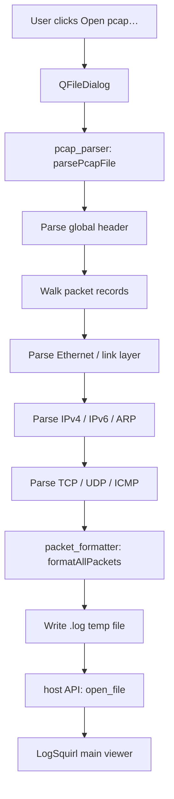

<!-- Allow GitHub's presentation markup and a logo before the main heading. -->
<!-- markdownlint-configure-file {"MD033": {"allowed_elements": ["div", "img"]}, "MD041": false} -->

<div align="center">


# tcpdump / pcap Viewer

**Packet captures you can actually read.**

**A [LogSquirl](https://github.com/64x-lunicorn/LogSquirl) plugin that turns
`.pcap` files into a readable packet list.**

Protocol dissection, application-layer detection and stream tracking — rendered
as text, so LogSquirl's regex search and highlighters work on it.

[](https://github.com/64x-lunicorn/LogSquirl-tcpdump/actions/workflows/ci-build.yml)
[](https://github.com/64x-lunicorn/LogSquirl-tcpdump/releases/latest)
[](https://github.com/64x-lunicorn/LogSquirl-tcpdump/releases)
[](#install)
[](LICENSE)

[Install](#install) &nbsp;/&nbsp;
[Usage](#usage) &nbsp;/&nbsp;
[Build](#build) &nbsp;/&nbsp;
[Architecture](#architecture) &nbsp;/&nbsp;
[Changelog](CHANGELOG.md)

</div>

---

## Why this plugin?

You have a capture and a log from the same incident, and they live in two
different tools. This one renders the capture as text in the viewer you already
have the log open in.

| Reads the capture | Shows the story |
| :--- | :--- |
| **Standard libpcap files.** `.pcap`, `.cap`, `.dmp`, both endiannesses, with a text preamble scan for `adb exec-out tcpdump` output. | **Wireshark-style columns.** No., Stream, Time, Source, Destination, Protocol, Len, Info — TCP flags in bracket notation. |
| **Protocol dissection.** IPv4, IPv6, TCP, UDP, ICMP, ICMPv6 and ARP. | **Conversations, not packets.** Stream IDs from the IP+port 4-tuple, so both directions filter together. |
| **Application layers.** TLS handshakes, HTTP requests and responses, DNS with domain names, NMEA 0183 sentences. | **Payload you can skim.** Printable text shown, binary runs collapsed, mostly-binary payloads suppressed. |
| **Link layers and tags.** Ethernet, Raw IP, Linux cooked capture v1 and v2, BSD loopback; 802.1Q VLAN tags stripped transparently. | **A capture at a glance.** Sidebar panel with protocol breakdown, top endpoints, duration, packets per second and file size. |

Port-based hints cover SSH, FTP, SMTP, IMAP, MySQL, PostgreSQL, Redis, MongoDB,
MQTT, AMQP, Kafka, ADB and twenty more.

## Install

### From LogSquirl

*Plugins → Browse Plugins…* → **tcpdump / pcap Viewer** → **Install**. The
archive is downloaded, verified against its SHA-256 checksum and loaded — no
file copying.

### From a release

Download the archive for your platform from the
[releases page](https://github.com/64x-lunicorn/LogSquirl-tcpdump/releases/latest)
and unpack it into LogSquirl's plugin directory:

| Platform | Plugin Directory |
|----------|-----------------|
| macOS    | `~/Library/Application Support/logsquirl/plugins/io.github.logsquirl.tcpdump/` |
| Linux    | `~/.local/share/logsquirl/plugins/io.github.logsquirl.tcpdump/` |
| Windows  | `%APPDATA%/logsquirl/plugins/io.github.logsquirl.tcpdump/` |

### From source

See [Build](#build), then:

```bash
DEST="$HOME/Library/Application Support/logsquirl/plugins/io.github.logsquirl.tcpdump"
mkdir -p "$DEST"
cp build/liblogsquirl_tcpdump.dylib "$DEST/"
cp plugin.json icon.png "$DEST/"
```

After installing, restart LogSquirl or re-scan via *Plugins → Manage Plugins…*.

## Usage

1. Open LogSquirl
2. In the sidebar, select the **tcpdump** tab
3. Click **Open pcap…** and select a `.pcap`, `.cap`, or `.dmp` file
4. The parsed packets will open as a text log in LogSquirl's viewer
5. Use LogSquirl's built-in search, filters, and highlighters on the
   packet data

## Example Output

```
No.    Stream Time           Source                                  Destination                             Protocol  Len    Info
1      1      0.000000       192.168.1.100                           10.0.0.1                                TCP       54     443 → 54321 [SYN] Seq=0 Ack=0 Win=65535
2      1      0.000500       10.0.0.1                                192.168.1.100                           TCP       54     54321 → 443 [SYN, ACK] Seq=0 Ack=1 Win=65535
3      1      0.001000       192.168.1.100                           10.0.0.1                                TCP       54     443 → 54321 [ACK] Seq=1 Ack=1 Win=65535
4      2      0.050000       192.168.1.100                           10.0.0.1                                DNS       72     53 → 12345 Len=34
5      -      0.100000       192.168.1.100                           10.0.0.1                                ICMP      74     Echo request
```

## Prerequisites

- **LogSquirl** ≥ 26.03 with the plugin system enabled
- **Qt6** (Core + Widgets) — same version LogSquirl was built with
- **CMake** ≥ 3.16
- A C++17-capable compiler (GCC ≥ 9, Clang ≥ 14, MSVC ≥ 19.29)

## Build

```bash
# Clone
git clone https://github.com/64x-lunicorn/LogSquirl-tcpdump.git
cd LogSquirl-tcpdump

# Configure
cmake -B build -S . -DCMAKE_BUILD_TYPE=Release

# If Qt6 is not in PATH (e.g. Homebrew on macOS):
cmake -B build -S . -DCMAKE_BUILD_TYPE=Release \
  -DCMAKE_PREFIX_PATH="$(brew --prefix qt6)"

# Build
cmake --build build

# The shared library is in build/:
#   macOS:   build/liblogsquirl_tcpdump.dylib
#   Linux:   build/liblogsquirl_tcpdump.so
#   Windows: build/logsquirl_tcpdump.dll
```

### Running Tests

```bash
cmake -B build -S . -DCMAKE_BUILD_TYPE=Release -DBUILD_TESTS=ON
cmake --build build
cd build && ctest --output-on-failure
```

## Architecture


```mermaid
graph TD
    A[User clicks Open pcap…] --> B[QFileDialog]
    B --> C[pcap_parser: parsePcapFile]
    C --> D[Parse global header]
    D --> E[Walk packet records]
    E --> F[Parse Ethernet / link layer]
    F --> G[Parse IPv4 / IPv6 / ARP]
    G --> H[Parse TCP / UDP / ICMP]
    H --> I[packet_formatter: formatAllPackets]
    I --> J[Write .log temp file]
    J --> K[host API: open_file]
    K --> L[LogSquirl main viewer]
```

## License

GPL-3.0-or-later — see [LICENSE](LICENSE) for the full license text.

The vendored `include/logsquirl_plugin_api.h` header is MIT-licensed, so
plugins of any license can build against the LogSquirl Plugin SDK without
taking on GPL obligations. See [NOTICE](NOTICE) for details.
