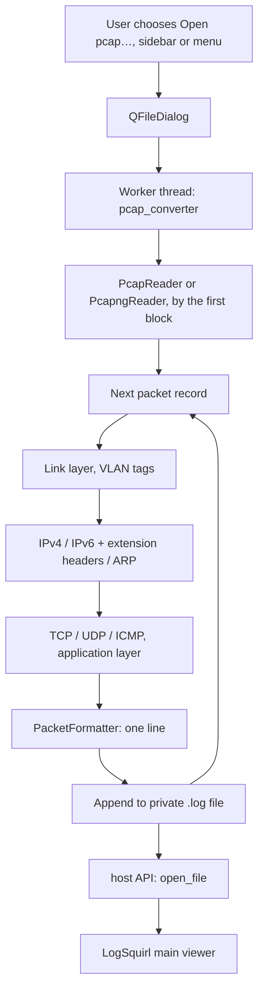

<!-- Allow GitHub's presentation markup and a logo before the main heading. -->
<!-- markdownlint-configure-file {"MD033": {"allowed_elements": ["div", "img"]}, "MD041": false} -->

<div align="center">


# tcpdump / pcap Viewer

**Packet captures you can actually read.**

**A [LogSquirl](https://github.com/64x-lunicorn/LogSquirl) plugin that turns
`.pcap` and `.pcapng` files into a readable packet list.**

Protocol dissection, application-layer detection and stream tracking — rendered
as text, so LogSquirl's regex search and highlighters work on it.

[](https://github.com/64x-lunicorn/LogSquirl-tcpdump/actions/workflows/ci-build.yml)
[](https://github.com/64x-lunicorn/LogSquirl-tcpdump/releases/latest)
[](https://github.com/64x-lunicorn/LogSquirl-tcpdump/releases)
[](#install)
[](LICENSE)

[Install](#install) &nbsp;/&nbsp;
[Usage](#usage) &nbsp;/&nbsp;
[Build](#build) &nbsp;/&nbsp;
[Architecture](#architecture) &nbsp;/&nbsp;
[Changelog](CHANGELOG.md)

</div>

---

## Why this plugin?

You have a capture and a log from the same incident, and they live in two
different tools. This one renders the capture as text in the viewer you already
have the log open in.

| Reads the capture | Shows the story |
| :--- | :--- |
| **pcap and pcapng files.** `.pcap`, `.pcapng`, `.cap`, `.dmp`, both endiannesses, microsecond and nanosecond timestamps, with a text preamble scan for `adb exec-out tcpdump` output. pcapng captures from Wireshark or macOS's `tcpdump -P` may mix interfaces of different link types and timestamp resolutions, and hold several sections. Read packet by packet in the background, so multi-GB captures work and can be cancelled. | **Wireshark-style columns.** No., Stream, UTC Time (`2026-10-09 08:41:12.123456Z`, the packet's wall-clock time in UTC), Time (since the first packet), Source, Destination, Protocol, Length (on the wire), Info — TCP flags in bracket notation, sequence and acknowledgement numbers relative to the start of each direction as in Wireshark (the SYN is `Seq=0`), the window scaled once both SYNs negotiated window scaling, and Wireshark's TCP analysis markers at the start of Info in its words — `[TCP Retransmission]`, `[TCP Fast Retransmission]`, `[TCP Dup ACK 7#1]`, `[TCP Out-Of-Order]`, `[TCP ZeroWindow]`, `[TCP Keep-Alive]` and more — so highlighters and filters written for Wireshark carry over; a packet cut at the snaplen is marked `[cut to N bytes]`. |
| **Protocol dissection.** IPv4, IPv6 with its extension headers, TCP, UDP, ICMP, ICMPv6 and ARP; IP fragments after the first are shown as such. ICMP and ICMPv6 in Wireshark's words: echoes with their id and seq (`Echo (ping) request id=0x1234, seq=7`), error messages with their code and the packet they quote (`Destination unreachable (Port unreachable) for 10.0.0.1:51234 → 192.168.1.5:53 UDP`), neighbor discovery with its target, link-layer address and flags. | **Conversations, not packets.** TCP and UDP stream numbers from addresses and ports, so both directions filter together; numbered per transport like Wireshark's `tcp.stream` and `udp.stream`, other packets show `-`. Once a stream's protocol is recognised (TLS, HTTP, …), every later packet of it carries that Protocol label, those in the middle of a record or body described as `Continuation`. |
| **Application layers.** TLS records, every one in a segment, with the server name (SNI), version and ALPN of a hello, QUIC packets on UDP with their type, version and connection IDs (short headers known from their connection's long headers), HTTP requests with their host and responses with their content type and length, HTTP/2 (cleartext) by its connection preface and the frames that follow, with their types and streams, DNS queries and responses with their transaction id, query type and answers, over UDP and TCP, NMEA 0183 sentences, SOCKS4/5 handshakes with their destinations and credentials. | **Payload you can skim.** Printable text shown, other bytes as dots, cut at 200 characters; mostly-binary payloads suppressed. |
| **Link layers and tags.** Ethernet, Raw IP, Linux cooked capture v1 and v2, BSD loopback (DLT_NULL, DLT_LOOP); stacked 802.1Q and QinQ tags stripped transparently. | **A capture at a glance.** Sidebar panel with protocol breakdown, top endpoints, duration, packets per second, file size and the TCP analysis markers per kind. |

Packets that are not dissected further are named, not numbered: IP protocols
such as IGMP, GRE, ESP, AH, OSPF, PIM, VRRP, L2TP and SCTP, and EtherTypes such
as LLDP, PPPoE discovery and session, MPLS, 802.1X (EAPOL), PTP and Wake-on-LAN;
an unknown one keeps its number, `IP(200)` or `ETH(0x1234)`. Port-based hints
name about a hundred TCP and UDP services: SSH, FTP, SMTP, IMAP, SNMP, Syslog,
TFTP, STUN/TURN, WireGuard, LLMNR, NBNS, DHCPv6, RTSP, LDAP, SMB, RDP, VNC,
Kerberos, MySQL, PostgreSQL, Redis, MongoDB, MQTT, AMQP, Kafka, ADB and more,
each only on the transport it runs over.

## Install

### From LogSquirl

*Plugins → Browse Plugins…* → **tcpdump / pcap Viewer** → **Install**. The
archive is downloaded, verified against its SHA-256 checksum and loaded — no
file copying.

### From a release

Download the archive for your platform from the
[releases page](https://github.com/64x-lunicorn/LogSquirl-tcpdump/releases/latest)
and unpack it into LogSquirl's plugin directory:

| Platform | Plugin Directory |
|----------|-----------------|
| macOS    | `~/Library/Application Support/logsquirl/plugins/io.github.logsquirl.tcpdump/` |
| Linux    | `~/.local/share/logsquirl/plugins/io.github.logsquirl.tcpdump/` |
| Windows  | `%APPDATA%/logsquirl/plugins/io.github.logsquirl.tcpdump/` |

The archive also holds `tcpdump_log.json`, the [Log Format](#log-format) for
the converted packet list, next to the library; LogSquirl does not load it
from there, copy it into its formats directory as described below.

### From source

See [Build](#build), then:

```bash
DEST="$HOME/Library/Application Support/logsquirl/plugins/io.github.logsquirl.tcpdump"
mkdir -p "$DEST"
cp build/liblogsquirl_tcpdump.dylib "$DEST/"
cp plugin.json icon.png "$DEST/"
```

and copy the [Log Format](#log-format) into LogSquirl's formats directory.

After installing, restart LogSquirl or re-scan via *Plugins → Manage Plugins…*.

## Usage

1. Open LogSquirl
2. In the sidebar, select the **tcpdump** tab
3. Click **Open pcap…** and select a `.pcap`, `.pcapng`, `.cap`, or `.dmp` file. The
   same dialog opens from **Plugins → tcpdump → Open pcap…**, and so from
   the Command Palette (`Ctrl+Shift+P`, `Cmd+Shift+P` on macOS); while a
   capture is being read, it only says so
4. The parsed packets will open as a text log in LogSquirl's viewer. A
   progress bar shows how far a large capture is read; **Cancel** stops it
5. The text is written to a new file in a private temporary directory,
   readable by you only, and removed when LogSquirl quits
6. Use LogSquirl's built-in search, filters, and highlighters on the
   packet data
7. With the [Log Format](#log-format) installed, switch to the table view
   with the toolbar's table button

### Log Format

LogSquirl recognises the packet list as a log with fields once it has the
plugin's Log Format definition, [`formats/tcpdump_log.json`](formats/tcpdump_log.json)
(lnav-compatible, like LogSquirl's built-in formats). It is a one-time copy:

1. Take `tcpdump_log.json` from the release archive (it lies next to the
   library), or from the [`formats`](formats/) folder of this repository
2. In LogSquirl, open **Options → Log Formats**, click **Open Formats
   Folder…** and copy the file there. The folder is

   | Platform | Formats Directory |
   |----------|-------------------|
   | macOS    | `~/Library/Application Support/logsquirl/formats/` |
   | Linux    | `~/.local/share/logsquirl/formats/` |
   | Windows  | `%APPDATA%/logsquirl/formats/` |

   (a portable LogSquirl uses the `formats` folder beside its executable)
3. Turn on **Auto-detect log format (table view)** on the same tab and click
   **OK**; formats are read again when the Options dialog is applied. A
   capture opened before keeps its format: open it again

A converted capture then gets:

- **Table View**: one column per field — `number`, `stream`, `timestamp`
  (the UTC Time), `time` (since the first packet), `source`,
  `destination`, `protocol`, `length` and `body` (the Info column)
- **Δt**: the time since the previous packet, right after the timestamp
- **Go to timestamp** (`Ctrl+Shift+L`) and **Set search limits to time
  range…**: the UTC Time is read with `%Y-%m-%d %H:%M:%S.%f%z`, at 6 or 9
  decimals (LogSquirl keeps milliseconds); type times in UTC, as the
  column shows them
- **Chart Panel templates**: *Message Rate* is packets per second (or per
  5 s, 10 s, minute), and *Numeric Fields* plots `length`, the bytes on
  the wire, over time
- **Export as CSV** from the table, one column per field

The sidebar summary links here once per session, since the plugin cannot
tell whether the format is installed.

## Example Output

```
No.    Stream  UTC Time                     Time           Source                                  Destination                             Protocol  Length Info
1      0       2026-10-09 08:41:12.123456Z  0.000000       192.168.1.100                           10.0.0.1                                TCP       54     443 → 54321 [SYN] Seq=0 Ack=0 Win=65535
2      0       2026-10-09 08:41:12.123956Z  0.000500       10.0.0.1                                192.168.1.100                           TCP       54     54321 → 443 [SYN, ACK] Seq=0 Ack=1 Win=65535
3      0       2026-10-09 08:41:12.124456Z  0.001000       192.168.1.100                           10.0.0.1                                TCP       54     443 → 54321 [ACK] Seq=1 Ack=1 Win=65535
4      0       2026-10-09 08:41:12.173456Z  0.050000       192.168.1.100                           10.0.0.1                                DNS       72     53 → 12345 Len=34
5      -       2026-10-09 08:41:12.223456Z  0.100000       192.168.1.100                           10.0.0.1                                ICMP      74     Echo (ping) request id=0x0001, seq=1
6      0       2026-10-09 08:41:12.243456Z  0.120000       10.0.0.1                                192.168.1.100                           TCP       1514   54321 → 443 [ACK] Seq=1 Ack=1 Win=65535 Len=1460 [cut to 96 bytes]
7      0       2026-10-09 08:41:12.243956Z  0.120500       192.168.1.100                           10.0.0.1                                TCP       54     443 → 54321 [ACK] Seq=1 Ack=1461 Win=65535
8      0       2026-10-09 08:41:12.244456Z  0.121000       192.168.1.100                           10.0.0.1                                TCP       54     [TCP Dup ACK 7#1] 443 → 54321 [ACK] Seq=1 Ack=1461 Win=65535
```

## Prerequisites

- **LogSquirl** ≥ 26.03 with the plugin system enabled
- **Qt6** (Core, Concurrent, Widgets) — same version LogSquirl was built with
- **CMake** ≥ 3.16
- A C++17-capable compiler (GCC ≥ 9, Clang ≥ 14, MSVC ≥ 19.29)

## Build

```bash
# Clone
git clone https://github.com/64x-lunicorn/LogSquirl-tcpdump.git
cd LogSquirl-tcpdump

# Configure
cmake -B build -S . -DCMAKE_BUILD_TYPE=Release

# If Qt6 is not in PATH (e.g. Homebrew on macOS):
cmake -B build -S . -DCMAKE_BUILD_TYPE=Release \
  -DCMAKE_PREFIX_PATH="$(brew --prefix qt6)"

# Build
cmake --build build

# The shared library is in build/:
#   macOS:   build/liblogsquirl_tcpdump.dylib
#   Linux:   build/liblogsquirl_tcpdump.so
#   Windows: build/logsquirl_tcpdump.dll
```

### Running Tests

```bash
cmake -B build -S . -DCMAKE_BUILD_TYPE=Release -DBUILD_TESTS=ON
cmake --build build
cd build && ctest --output-on-failure
```

## Architecture


```mermaid
graph TD
    A[User chooses Open pcap…, sidebar or menu] --> B[QFileDialog]
    B --> C[Worker thread: pcap_converter]
    C --> D[PcapReader or PcapngReader, by the first block]
    D --> E[Next packet record]
    E --> F[Link layer, VLAN tags]
    F --> G[IPv4 / IPv6 + extension headers / ARP]
    G --> H[TCP / UDP / ICMP, application layer]
    H --> I[PacketFormatter: one line]
    I --> J[Append to private .log file]
    J --> E
    J --> K[host API: open_file]
    K --> L[LogSquirl main viewer]
```

## License

GPL-3.0-or-later — see [LICENSE](LICENSE) for the full license text.

The vendored `include/logsquirl_plugin_api.h` header is MIT-licensed, so
plugins of any license can build against the LogSquirl Plugin SDK without
taking on GPL obligations. See [NOTICE](NOTICE) for details.
