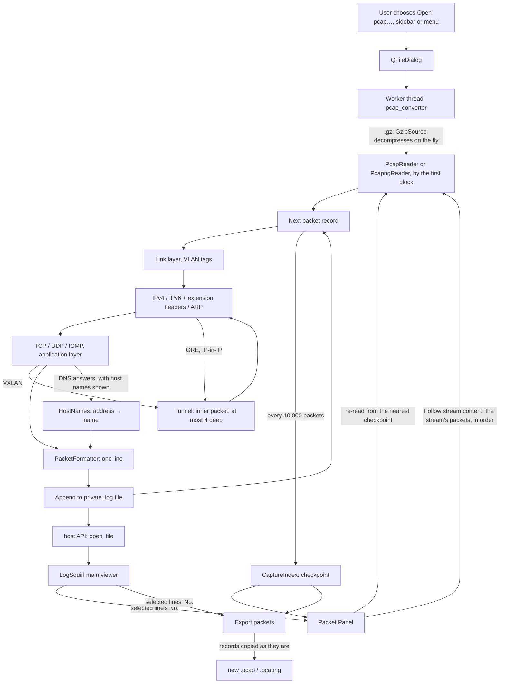

<!-- Allow GitHub's presentation markup and a logo before the main heading. -->
<!-- markdownlint-configure-file {"MD033": {"allowed_elements": ["div", "img"]}, "MD041": false} -->

<div align="center">


# tcpdump / pcap Viewer

**Packet captures you can actually read.**

**A [LogSquirl](https://github.com/64x-lunicorn/LogSquirl) plugin that turns
`.pcap` and `.pcapng` files into a readable packet list.**

Protocol dissection, application-layer detection and stream tracking — rendered
as text, so LogSquirl's regex search and highlighters work on it.

[](https://github.com/64x-lunicorn/LogSquirl-tcpdump/actions/workflows/ci-build.yml)
[](https://github.com/64x-lunicorn/LogSquirl-tcpdump/releases/latest)
[](https://github.com/64x-lunicorn/LogSquirl-tcpdump/releases)
[](#install)
[](LICENSE)

[Install](#install) &nbsp;/&nbsp;
[Usage](#usage) &nbsp;/&nbsp;
[Build](#build) &nbsp;/&nbsp;
[Architecture](#architecture) &nbsp;/&nbsp;
[Changelog](CHANGELOG.md)

</div>

---

## Why this plugin?

You have a capture and a log from the same incident, and they live in two
different tools. This one renders the capture as text in the viewer you already
have the log open in.

| Reads the capture | Shows the story |
| :--- | :--- |
| **pcap and pcapng files.** `.pcap`, `.pcapng`, `.cap`, `.dmp`, also gzip-compressed (`.pcap.gz`, `.pcapng.gz`, `.cap.gz`, as Wireshark opens them, decompressed on the fly), both endiannesses, microsecond and nanosecond timestamps, with a text preamble scan for `adb exec-out tcpdump` output. pcapng captures from Wireshark or macOS's `tcpdump -P` may mix interfaces of different link types and timestamp resolutions, and hold several sections. Read packet by packet in the background, so multi-GB captures work and can be cancelled. | **Wireshark-style columns.** No., Stream, UTC Time (`2026-10-09 08:41:12.123456Z`, the packet's wall-clock time in UTC), Time (since the first packet), Source, Destination, Protocol, Length (on the wire), Info — TCP flags in bracket notation, sequence and acknowledgement numbers relative to the start of each direction as in Wireshark (the SYN is `Seq=0`), the window scaled once both SYNs negotiated window scaling, a SYN's options as Wireshark shows them (`MSS=1460 SACK_PERM TSval=… TSecr=0 WS=128`), the handshake's initial round-trip time on the ACK that completes it (`[iRTT=0.012345]`), and Wireshark's TCP analysis markers at the start of Info in its words — `[TCP Retransmission]`, `[TCP Fast Retransmission]`, `[TCP Dup ACK 7#1]`, `[TCP Out-Of-Order]`, `[TCP Window Full]`, `[TCP ZeroWindow]`, `[TCP Keep-Alive]` and more — so highlighters and filters written for Wireshark carry over; a packet cut at the snaplen is marked `[cut to N bytes]`. |
| **Protocol dissection.** IPv4, IPv6 with its extension headers, TCP, UDP, ICMP, ICMPv6 and ARP; IP fragments after the first are shown as such. VXLAN, GRE and IP-in-IP tunnels are unwrapped: a tunnelled packet is shown by the packet inside, its stream keyed by the inner addresses and ports, the tunnel named first in Info (`VXLAN VNI 100 | 50000 → 8080 [SYN] Seq=0 Win=64240`, `GRE | …`, `IPv6-in-IPv4 | …`), at most 4 tunnels deep. ICMP and ICMPv6 in Wireshark's words: echoes with their id and seq (`Echo (ping) request id=0x1234, seq=7`), error messages with their code and the packet they quote (`Destination unreachable (Port unreachable) for 10.0.0.1:51234 → 192.168.1.5:53 UDP`), neighbor discovery with its target, link-layer address and flags. | **Conversations, not packets.** TCP and UDP stream numbers from addresses and ports, so both directions filter together; numbered per transport like Wireshark's `tcp.stream` and `udp.stream`, other packets show `-`. Once a stream's protocol is recognised (TLS, HTTP, …), every later packet of it carries that Protocol label, those in the middle of a body or a record that is not reassembled described as `Continuation`. |
| **Application layers.** TLS records, every one in a segment, with the server name (SNI), version and ALPN of a hello, QUIC packets on UDP with their type, version and connection IDs (short headers known from their connection's long headers), HTTP requests with their host and responses with their content type and length, HTTP/2 (cleartext) by its connection preface and the frames that follow, with their types and streams, DNS queries and responses with their transaction id, query type and answers, over UDP and TCP, DHCP messages with their type, transaction id, client MAC, address and host name (`DHCP Offer - Transaction ID 0x3903f326, 192.168.1.50 for 00:11:22:33:44:55`), DHCPv6 messages with their type and client DUID, NTP packets with their version, mode and stratum (`NTP Version 4, server, stratum 2`), NMEA 0183 sentences, SOCKS4/5 handshakes with their destinations and credentials, MQTT 3.1.1 and 5.0 control packets (TCP 1883, or any port behind a CONNECT), every one in a segment, with client id, topic, QoS, packet id, reason code and a payload preview (`Publish Message (QoS 1, id=2) [alerts/door] "open"`), SIP requests and responses on any port, over UDP and TCP, with CSeq, Call-ID and their SDP bodies (`Status: 200 OK (INVITE), CSeq 1, Call-ID a84b4c76e667…, SDP (audio 3456 RTP/AVP 0)`), RTP and RTCP on the addresses and ports SDP announced (`PT=PCMU, SSRC=0x1234ABCD, Seq=1000, Time=8000`, `Sender Report, Source description`), SOME/IP over UDP and TCP on port 30490, on configured ports and wherever its header fits, every message of a datagram or segment, with its IDs, message type and return code (`Service 0x1234 Method 0x0001 Client 0x0010 Session 0x0001 ERROR (E_NOT_OK), 0 bytes`, names from an optional name table), and SOME/IP-SD entries with their endpoint options (`Offer Service 0x1234 Instance 0x0001 v1.0 TTL=3 (192.0.2.10:30501 UDP)`, `Subscribe Eventgroup Ack …`), DoIP (ISO 13400-2) on UDP and TCP port 13400, every message of a datagram or segment as Wireshark names it, vehicle announcements with their VIN, logical address, EID and GID, routing activation with its source address, type and response code, and diagnostic messages with their addresses and the UDS service, sub-function and negative response code they carry (`Diagnostic message 0x0E00 → 0x1000, UDS ReadDataByIdentifier 0xF190`, `UDS Negative Response ReadDataByIdentifier NRC=0x31 (requestOutOfRange)`), and SSH on any port by its banner, port 22 as a hint, as Wireshark shows it: the banners (`Client: Protocol (SSH-2.0-OpenSSH_9.6)`), the key exchange with KEXINIT's algorithm lists shortened (`Client: Key Exchange Init kex=curve25519-sha256,… hostkey=ssh-ed25519,… cipher=chacha20-poly1305@openssh.com,…`, `Elliptic Curve Diffie-Hellman Key Exchange Reply, New Keys`), and each direction's packets after its NEWKEYS as `Encrypted packet (len=64)`, and WebSocket from the HTTP upgrade on, whatever the port, every frame as Wireshark names it, the client's text unmasked for the preview (`WebSocket Text [FIN] [MASKED] len=5 "Hello"`, `WebSocket Connection Close [FIN] len=2 Normal Closure (1000)`, compressed messages `[COMPRESSED]`), and SMB2/3 on TCP port 445 and over NetBIOS on 139, every command of a segment, compounded ones too, as Wireshark names it, with the dialects, share, file name, read and write lengths and offsets, FSCTL and find pattern, a failed response with its NT status (`Tree Connect Request Tree: \\server\share`, `Create Request File: dir\file.txt`, `Session Setup Response, Error: STATUS_MORE_PROCESSING_REQUIRED`), encrypted messages as `Encrypted SMB3` and SMB1 by its command. A TLS record, an HTTP header section, a DNS-over-TCP message, a SIP message, an MQTT packet on port 1883, a SOME/IP message, a DoIP message, an SSH packet of the key exchange, a WebSocket frame or an SMB message that spans TCP segments is reassembled and described once, on the segment that completes it (`Client Hello, SNI=example.com, TLS 1.3 [reassembled from 3 segments]`), the segments before it as `[TCP segment of a reassembled PDU]`; segments are put in sequence order, retransmissions and overlaps dropped, within bounded memory. With an `SSLKEYLOGFILE`, TLS 1.2 and 1.3 sessions are [decrypted](#tls-decryption) and the HTTP/1.1 and HTTP/2 inside described, HPACK decoded (`TLS (decrypted) \| GET example.com/ HTTP/1.1`). | **Payload you can skim.** Printable text shown, other bytes as dots, cut at 200 characters; mostly-binary payloads suppressed. |
| **Link layers and tags.** Ethernet, Raw IP, Linux cooked capture v1 and v2, BSD loopback (DLT_NULL, DLT_LOOP); Wi-Fi (802.11, with or without a Radiotap header), PPP, Cisco HDLC and PPPoE; stacked 802.1Q and QinQ tags stripped transparently. 802.11 management and control frames are named as Wireshark names them, between MAC addresses (`Beacon frame, SN=1000, FN=0, BI=100, SSID="HomeNet"`, `Probe Request`, `Authentication`, `Request-to-send`); data frames reach IP through LLC/SNAP, encrypted ones show as `QoS Data, SN=6, FN=0, Protected`. PPP and PPPoE sessions reach IP; LCP, IPCP, IPv6CP, PAP and CHAP are named with their message (`Configuration Request`, `Echo Reply`, `Authenticate-Request`, no credentials), PPPoE discovery with its stage (`Active Discovery Offer (PADO) AC-Name='isp'`). | **A capture at a glance.** Sidebar panel with protocol breakdown, top endpoints, duration, packets per second, file size and the TCP analysis markers per kind. |

Packets that are not dissected further are named, not numbered: IP protocols
such as IGMP, GRE, ESP, AH, OSPF, PIM, VRRP, L2TP and SCTP, and EtherTypes such
as LLDP, MPLS, 802.1X (EAPOL), PTP and Wake-on-LAN;
an unknown one keeps its number, `IP(200)` or `ETH(0x1234)`. Port-based hints
name about a hundred TCP and UDP services: SSH, FTP, SMTP, IMAP, SNMP, Syslog,
TFTP, STUN/TURN, WireGuard, LLMNR, NBNS, DHCPv6, RTSP, LDAP, SMB, RDP, VNC,
Kerberos, MySQL, PostgreSQL, Redis, MongoDB, MQTT, AMQP, Kafka, ADB and more,
each only on the transport it runs over.

## Install

### From LogSquirl

*Plugins → Browse Plugins…* → **tcpdump / pcap Viewer** → **Install**. The
archive is downloaded, verified against its SHA-256 checksum and loaded — no
file copying.

### From a release

Download the archive for your platform from the
[releases page](https://github.com/64x-lunicorn/LogSquirl-tcpdump/releases/latest)
and unpack it into LogSquirl's plugin directory:

| Platform | Plugin Directory |
|----------|-----------------|
| macOS    | `~/Library/Application Support/logsquirl/plugins/io.github.logsquirl.tcpdump/` |
| Linux    | `~/.local/share/logsquirl/plugins/io.github.logsquirl.tcpdump/` |
| Windows  | `%APPDATA%/logsquirl/plugins/io.github.logsquirl.tcpdump/` |

The archive also holds, next to the library, `tcpdump_log.json`, the
[Log Format](#log-format) for the converted packet list, and
`tcpdump_highlighter.conf` and `tcpdump_filter.conf`, the [highlighter set
and filter group](#highlighters-and-filters). LogSquirl loads none of them
from there: copy the Log Format into its formats directory and import the
other two, as described below.

### From source

See [Build](#build), then:

```bash
DEST="$HOME/Library/Application Support/logsquirl/plugins/io.github.logsquirl.tcpdump"
mkdir -p "$DEST"
cp build/liblogsquirl_tcpdump.dylib "$DEST/"
cp plugin.json icon.png "$DEST/"
```

and copy the [Log Format](#log-format) into LogSquirl's formats directory.

After installing, restart LogSquirl or re-scan via *Plugins → Manage Plugins…*.

## Usage

1. Open LogSquirl
2. In the sidebar, select the **tcpdump** tab
3. Click **Open pcap…** and select a `.pcap`, `.pcapng`, `.cap`, or `.dmp` file,
   or a gzip-compressed one (`.pcap.gz`, `.pcapng.gz`, `.cap.gz`; told by
   its content, not its name). A compressed capture is decompressed while
   it is read, never as a whole, and the progress bar counts its compressed
   bytes; one whose gzip stream is cut off or corrupt shows its packets up
   to there and says so in the summary. zstd and xz are not read:
   decompress such a file first. The
   same dialog opens from **Plugins → tcpdump → Open pcap…**, and so from
   the Command Palette (`Ctrl+Shift+P`, `Cmd+Shift+P` on macOS); while a
   capture is being read, it only says so
4. The parsed packets will open as a text log in LogSquirl's viewer. A
   progress bar shows how far a large capture is read; **Cancel** stops it
5. The text is written to a new file in a private temporary directory,
   readable by you only, and removed when LogSquirl quits
6. The sidebar shows the summary of the capture in the tab in front:
   switching tabs switches it, and a tab that is not a converted capture
   shows none. Under *Analysis* it gives the median initial round-trip time
   (iRTT) of the TCP handshakes captured whole, and the segments per TCP
   analysis marker
7. Use LogSquirl's built-in search, filters, and highlighters on the
   packet data; the plugin's [highlighter set and filter
   group](#highlighters-and-filters) colour and filter it as Wireshark does
8. To follow a conversation, as Wireshark's *Follow TCP Stream* does, select
   one of its packet lines and click **Follow stream** in the sidebar, or
   choose **Plugins → tcpdump → Follow stream**. LogSquirl's Regex Lab opens
   with a pattern that matches that TCP or UDP stream's lines: its number in
   the Stream column, its two addresses and its two ports, in either
   direction (TCP and UDP streams are numbered each on their own). Apply it,
   and the filtered view shows the conversation alone. A line without a
   stream (`-` or `?`), no selection, or a line of another log only shows a
   notification saying why. Needs LogSquirl ≥ 26.11
9. To filter by an endpoint or a protocol, as Wireshark's *Apply as Filter*
   from its statistics, click it in the sidebar summary: the Regex Lab opens
   with a pattern that matches the lines with that address in the Source or
   Destination column, or that name in the Protocol column (not where either
   only appears in Info). Apply it to filter the view. The endpoints of
   tunnels, listed apart under *Tunnel endpoints*, are no links: a
   tunnelled packet's line shows the packet inside, so their addresses are
   in no column. Needs LogSquirl ≥ 26.11; on an older one the summary lists
   the endpoints and protocols as plain text
10. To look into a packet, as Wireshark's lower panes do, select its line:
   the **Packet** panel below the sidebar summary shows its layers as a
   tree (Frame, Ethernet, IP, TCP/UDP/ICMP, tunnels, the application
   protocol the payload was recognised as) with every field named, and its
   bytes as a hex and ASCII dump; selecting a layer or field highlights its
   bytes. The panel follows the selection while the tcpdump tab is in view
   (it asks LogSquirl at most every 250 ms, and not at all while hidden),
   and **Plugins → tcpdump → Packet details** shows the selected line's
   packet at once. The packet is read again from the capture file, found
   by the line's No.: the plugin keeps a file position every 10,000 packets
   while converting, so no packet is kept in memory. A capture file that
   was changed, moved or removed after it was opened is reported, not
   misread; open it again. Needs LogSquirl ≥ 26.11
11. To see what a conversation carried, as Wireshark's *Follow TCP/UDP
   Stream* window does, select one of its packet lines and click **Follow
   stream content** in the Packet panel, or choose **Plugins → tcpdump →
   Follow stream content**. The panel's **Stream** tab shows the payload of
   the whole TCP or UDP stream, the client's bytes (the side that sent the
   first packet) in red and the server's in blue, as **Text** (UTF-8 kept,
   other control bytes as `\xNN`) or **Hex** (Wireshark's dump, the
   offset counted per direction, the server's lines indented), both
   directions or one. TCP bytes are put in sequence order as the
   reassembly orders them: a segment captured early waits for those before
   it, retransmitted and overlapping bytes are shown once, and bytes the
   capture lacks show as `[n bytes missing]`; UDP shows its datagrams, each
   on its line. The stream is read again from the capture file in the
   background, with a progress bar and **Cancel**; the first 1 MB is
   shown, **Show more** reads 1 MB more each time, up to 16 MB, and a note
   says when there is more. **Export…** writes the whole stream to a file,
   however long: the raw bytes of the directions shown (gaps left out), or
   the text as shown. Needs LogSquirl ≥ 26.11
12. To see the capture's conversations, as Wireshark's *Statistics →
   Conversations*, look at the **Conversations** table below the packet:
   a row per TCP and UDP stream with its Stream (`TCP 3`, `UDP 0`), its
   protocol (the label its stream was recognised by, else `TCP` or `UDP`),
   ends A (which sent its first packet) and B with their ports, packets and
   bytes in all and each way (bytes on the wire, as the Length column),
   its start in seconds after the capture's first packet and its duration.
   Click a column header to sort by it. Click a conversation, or choose
   **Filter on this conversation** from its context menu, and the Regex
   Lab opens with the pattern of that stream's lines, as **Follow stream**
   builds it; apply it to filter the view (needs LogSquirl ≥ 26.11). The
   table is counted while converting, for the streams that get a number:
   past the stream cap (see [Options](#options)), the packets of all other
   streams are one row, `?` *Other streams*
13. To share some packets, or open them in Wireshark, select their lines
   (in the Filtered View, e.g., all lines a filter or search left) and
   choose **Plugins → tcpdump → Export packets…**. A dialog shows their
   packet numbers as ranges (`1-5, 9`): change them, or paste packet lines
   copied in LogSquirl, then choose the file. LogSquirl tells the plugin at
   most the first 1,000 selected lines (and at most 1 MiB of them); the
   dialog says when there were more, and pasting the copied lines exports
   them all. The packets are copied from the capture file record by record,
   unchanged: a pcap gives a `.pcap` with the capture's header, a pcapng a
   `.pcapng` with the section headers and interfaces of the exported
   packets (other pcapng blocks, such as name resolution, are left out);
   the packets of a gzip-compressed capture are exported uncompressed.
   The capture is read once from front to back in the background; a
   progress dialog shows how far, and Cancel leaves no file. Needs
   LogSquirl ≥ 26.11
14. To filter as with a Wireshark display filter, choose **Plugins →
   tcpdump → Display filter…** (also in the Command Palette) and type one,
   such as `ip.addr == 10.0.0.1 && tcp.port == 443`: the Regex Lab opens
   with the pattern of the packet lines it selects; apply it to filter the
   view. A filter outside the [supported subset](#display-filters) is
   rejected below the field with its column and the reason. Needs
   LogSquirl ≥ 26.11
15. With the [Log Format](#log-format) installed, switch to the table view
   with the toolbar's table button

### Live capture

Start a live capture from the **Live capture** section of the plugin's
sidebar tab, or with **Plugins → tcpdump → Start live capture…** (also in
the Command Palette), which shows the same fields in a dialog:

- **Source**: where to capture. Each source the plugin offers is listed;
  one that cannot be used on this computer shows why, e.g. that a program
  it needs is not installed
- **Device**, for a source that has devices (a phone, a host), and
  **Interface**: listed by the source in the background, with a
  description where the source has one; **Refresh** lists them anew. An
  interface the source does not list can be typed
- **Capture filter**: a BPF filter such as `host 10.0.0.1 and tcp port
  443`, passed to the source as it is (empty captures everything). A line
  break, a leading `-`, unbalanced parentheses or a Wireshark display
  filter field such as `ip.addr` are pointed out below the field and keep
  Start disabled; anything else is checked by the capture program, whose
  error the section shows
- **Snaplen**: the bytes kept of each packet, 262144 by default; a packet
  cut shorter is marked `[cut to N bytes]`
- **Stop after time / packets / size**: the capture stops by itself at the
  first of them it reaches, as with Stop (dumpcap's `-a duration`,
  `packets`, `filesize`). The size is that of the raw capture, in MB of
  1024 × 1024 bytes. The packet that reaches a count or a size is the last
  one; the time also runs out while no packet comes. *No limit* by default
- **Ring buffer** and **New file after**: for captures that run for hours
  or days (dumpcap's `-b`). With *N files*, the raw capture is split into
  files of the size or duration given, and only the newest N are kept;
  see *Ring buffer* below. *Off* by default
- **Start** and **Stop** (also **Plugins → tcpdump → Stop live capture**).
  Start is disabled while a capture file is read or a live capture runs;
  one live capture runs at a time, and the menu entry offers to stop the
  running one first

The choices started last are remembered in the plugin's `settings.ini` and
shown again after a restart, and so are each source's own options, for a
source that has any. The plugin never stores a password: one a source's
options ask for (an extcap's password argument) is kept in memory for the
session only. While the capture runs, the section shows what the capture
program writes to stderr (also in LogSquirl's log); if it fails, the
section shows why, with what the source says to do about it.

#### Local: this computer, with dumpcap or tcpdump

The **Local** source captures on this computer's interfaces with
Wireshark's `dumpcap` if it is installed (preferred: it is on every OS and
writes pcapng), else with `tcpdump`. Both are looked for on `PATH` and where
their installers put them: `/Applications/Wireshark.app/Contents/MacOS/dumpcap`
and `/usr/sbin/tcpdump` on macOS, `/usr/bin/dumpcap` and `/usr/sbin/tcpdump`
on Linux, `Program Files\Wireshark\dumpcap.exe` on Windows. Without either,
the source says what to install. Its interfaces are those `dumpcap -D` or
`tcpdump -D` lists; it captures with `dumpcap -i <interface> -s <snaplen>
-q -f <filter> -w -` or `tcpdump -i <interface> -s <snaplen> -U -w -
<filter>`, the filter passed as one argument.

The plugin **never runs sudo and never asks for a password**: the capture
program must be allowed to capture as you. When it is not (it says
"permission denied" or "You don't have permission", lists no interfaces,
or, on macOS, `/dev/bpf0` cannot be read), the section says what to do on
your OS; run the command yourself, once:

- **macOS**: capturing needs read access to `/dev/bpf*`. Install
  **ChmodBPF** from the [Wireshark](https://www.wireshark.org/download.html)
  disk image ("Install ChmodBPF.pkg"): it lets the group `access_bpf` read
  `/dev/bpf*` and adds you to it. If it is installed but you are not in the
  group: `sudo dseditgroup -o edit -a "$USER" -t user access_bpf`, then log
  out and in again
- **Linux**: capturing needs `CAP_NET_RAW` and `CAP_NET_ADMIN`. With
  dumpcap, join the `wireshark` group (on Debian and Ubuntu first `sudo
  dpkg-reconfigure wireshark-common`, answering Yes): `sudo usermod -aG
  wireshark "$USER"`, then log out and in again; or give the program the
  capabilities: `sudo setcap cap_net_raw,cap_net_admin=eip /usr/bin/dumpcap`
  (or `/usr/sbin/tcpdump`)
- **Windows**: install [Npcap](https://npcap.com/#download) (Wireshark's
  installer offers it), leaving "Restrict Npcap driver's access to
  Administrators only" unchecked, so that LogSquirl need not run as
  administrator

#### Android: a phone or an emulator, through adb

The **Android** source captures on an Android device with the device's own
`tcpdump`, through `adb`. It finds `adb` on `PATH`, in the SDK's
`platform-tools` below `ANDROID_HOME` or `ANDROID_SDK_ROOT`, and where
Android Studio and package managers put it (`~/Library/Android/sdk`,
`~/Android/Sdk`, `%LOCALAPPDATA%\Android\Sdk`, `/opt/homebrew/bin`,
`/usr/lib/android-sdk`); without it, the source says where to get the
[Platform-Tools](https://developer.android.com/tools/releases/platform-tools).

- **Devices** are those of `adb devices -l`, with their model. One that is
  `unauthorized` (allow USB debugging in the prompt on the device),
  `offline` (reconnect it, or `adb kill-server`) or without permissions
  (Linux: a udev rule) is listed with what to do, and cannot be chosen
- **Interfaces** are `any` and those of `ip -o link` on the device. Listing
  them also asks the device whether it can capture, and says what to do if
  it cannot
- **Root**: capturing needs it. The source uses it when `adb` already runs
  as root (an emulator image without Google Play, or a userdebug or eng
  build, after you ran `adb root` yourself: LogSquirl never runs it), or
  when `su -c` gives root without a prompt (a rooted device whose su
  manager, e.g. Magisk, granted the Shell app). Otherwise it says that a
  stock, unrooted device cannot capture this way
- **tcpdump** is looked for on the device's `PATH`, in `/system/bin` and
  `/system/xbin` (emulators and userdebug builds have it), and in
  `/data/local/tmp`: on another device, push a static `tcpdump` built for
  its CPU there (`adb push tcpdump /data/local/tmp/`, `adb shell chmod 755
  /data/local/tmp/tcpdump`)

It captures with `adb -s <serial> exec-out` (binary-clean: no terminal, no
CR/LF translation) running `tcpdump -i <interface> -s <snaplen> -U -w -
<filter>` on the device, through `su -c` where that is how root is had.
The interface and the filter are single-quoted for the device's shell, so
a filter is always one argument of tcpdump and never shell syntax.
tcpdump's stderr is kept in a file on the device and shown if the capture
fails. **Stop** ends tcpdump on the device too, not only the local `adb`,
also when it comes before tcpdump has fully started, and removes its files.
If LogSquirl crashes or is killed during a capture, nothing tells the
device: tcpdump runs on until it next writes to the closed stream (its
next captured packet), and its `logsquirl-*.pid`/`.err` files stay in
`/data/local/tmp`, which `adb shell rm /data/local/tmp/logsquirl-*` (through
`su -c` for a root capture) removes.

#### Remote capture over SSH

The **SSH** source captures on a server: it runs `tcpdump` there over
your system's OpenSSH client (`ssh` on `PATH`; on Windows
`C:\Windows\System32\OpenSSH\ssh.exe`, the optional feature *OpenSSH
Client*) and shows the traffic live. Type the **Host** as
`[user@]host[:port]` (`[address]:port` for an IPv6 address with a port), or
pick one of the `Host` entries of `~/.ssh/config` that name one host (no
wildcards); press Enter to list its interfaces, which are what `tcpdump -D`
lists on the server (run with `sudo -n` while *Run tcpdump with sudo -n* is
on, and listed anew when it is turned on or off), or, if that lists
nothing, what `ip -o link` lists, with what tcpdump said. Every ssh runs as

```
ssh -T -o BatchMode=yes -o ConnectTimeout=10 [-p <port>] -- <user@host> <remote command>
```

so **only your keys and the SSH agent are used**: ssh never asks for a
password, a passphrase or whether to trust a host key, and the plugin never
asks for or stores one. The remote command runs `/bin/sh` on the server,
whatever your login shell is (it only has to read one single-quoted word,
as sh, bash, dash, zsh, ksh, csh and tcsh do; fish reads a `\` inside
single quotes, so a filter with a backslash needs a POSIX login shell). The
script `/bin/sh` runs has the interface and the capture filter in single
quotes, so nothing in them is run:

```
exec /bin/sh -c '… [sudo -n] tcpdump -i <interface> -s <snaplen> -U -w - "(<filter>) and not (host <client> and tcp port <SSH port>)" & <watchdog> …'
```

**Stop** ends tcpdump on the server too, also when it runs as root: ssh's
stdin is a pipe the plugin holds open while the capture runs, and a
watchdog in the script ends tcpdump once it closes, as Stop ends ssh or the
connection drops (without a terminal the server sends no hangup, and
tcpdump alone would notice only at its next packet). If LogSquirl itself
is killed, the connection closes and the watchdog ends tcpdump all the
same.

Two options below the fields:

- **Run tcpdump with sudo -n** (on by default): capture as root with
  `sudo -n`, which never prompts; a sudo that wants a password fails, and
  the section says how to allow tcpdump without one. On the server, `sudo
  visudo -f /etc/sudoers.d/tcpdump` and add `<user> ALL=(root) NOPASSWD:
  /usr/bin/tcpdump` (the path `command -v tcpdump` prints). Off, tcpdump
  runs as the SSH user, who then needs the capture capabilities: `sudo
  setcap cap_net_raw,cap_net_admin=eip $(command -v tcpdump)`
- **Exclude this SSH connection** (on by default): the capture filter gets
  `and not (host <client> and tcp port <SSH port>)`, the address and port
  the server sees this connection come from and arrive at (`$SSH_CLIENT`),
  so that the capture does not capture its own transport

When ssh, sudo or tcpdump fail, the section shows what they wrote and what
to do: a host key ssh does not know (connect once in a terminal and accept
it, after checking its fingerprint) or one that changed (`ssh-keygen -R`),
keys the server refuses (`ssh-add`, `ssh-copy-id`, `IdentityFile`), a sudo
that wants a password, tcpdump missing on the server or lacking
permissions, a host that cannot be reached.

#### Wireshark extcap: sshdump, androiddump, ciscodump, udpdump, …

The **Wireshark extcap** source makes every
[extcap](https://www.wireshark.org/docs/wsdg_html_chunked/ChCaptureExtcap.html)
you have a live source: the ones Wireshark ships (`sshdump`, `ciscodump`,
`androiddump`, `udpdump`, `randpktdump`, `wifidump`, …) and any other,
e.g. a vendor's. It looks for them, in this order, in

- the directories in `WIRESHARK_EXTCAP_DIR` (separated as `PATH` is),
- your personal extcap directory: `~/.local/lib/wireshark/extcap` or
  `~/.config/wireshark/extcap`; `%APPDATA%\Wireshark\extcap` on Windows,
- Wireshark's own: `/Applications/Wireshark.app/Contents/MacOS/extcap` on
  macOS (also `~/Applications/…`, and Homebrew's `lib/wireshark/extcap`),
  `/usr/lib/<arch>-linux-gnu/wireshark/extcap`, `/usr/lib/wireshark/extcap`,
  `/usr/lib64/…` or `/usr/libexec/…` on Linux,
  `Program Files\Wireshark\extcap` on Windows,

each with its `wireshark` subdirectory, where Wireshark 4.2 and later keep
theirs. Without any extcap, the source says where they come from.

- **Extcap** is the device: each extcap found, asked for its interfaces
  (`--extcap-interfaces`). One that fails is listed with its error and
  cannot be chosen
- **Interface**: the interfaces the chosen extcap reports
- Its **arguments** (`--extcap-interface <interface> --extcap-config`)
  are shown as a form below the snaplen: text, numbers (checked against
  their range), check boxes, drop-down lists, radio buttons, lists of check
  boxes and file paths, each with its default; a required one left empty
  keeps Start disabled. The link type it captures (`--extcap-dlts`) is
  shown above them. The values are remembered per interface in
  `settings.ini`, except a **password** (or an argument the extcap says not
  to save), which is kept for this session only and never written there

It captures with `<extcap> --capture --extcap-interface <interface> --fifo
<pipe> [--extcap-capture-filter <filter>] --<argument>=<value> …`, every
value one argument, never through a shell. The extcap writes into a FIFO
the plugin makes in its private temporary directory (readable by you
alone), or a named pipe `\\.\pipe\logsquirl-tcpdump-…` on Windows; its
stderr is shown as a capture program's, and **Stop** ends it with what it
started. An extcap's toolbar controls (`--extcap-control-in`/`-out`) are
not used: extcaps capture without them. Note that, as with Wireshark, a
password argument is on the extcap's command line, which other users of
the computer may see in its process list while it runs. The snaplen is not
passed: an extcap has its own option for that, if any.

On Windows an extcap that is a batch file (`.bat`, `.cmd`) is run by
`cmd.exe`, which reads its arguments again, quoted or not. For such an
extcap the capture filter, the interface and every argument's value must
not hold `%`, `!`, `^`, `&`, `|`, `<`, `>`, `(`, `)`, `"` or a line break:
Start says which one is in the way, and the plugin never runs it with one.

#### Custom command

The **Custom command** source runs a command you write and converts what it
writes to stdout, which must be a **pcap or pcapng capture** (text before
the capture's header, up to 4 KB, is skipped; messages belong on stderr,
which the section shows). Use it for what the other sources do not cover:
a vendor tool, `nc -l 9999`, a capture on a router. Examples to start from
(choosing one fills the line; nothing runs until you press Start):

```
tcpdump -i {interface} -U -w - {filter}
adb exec-out tcpdump -i {interface:sh} -s {snaplen} -U -w - {filter:sh}
ssh -o BatchMode=yes user@host tcpdump -i {interface:sh} -s {snaplen} -U -w - {filter:sh}
```

The line is a program and its arguments, **split like a shell splits it,
but no shell runs it**: blanks separate arguments, `'…'` and `"…"` quote
(in `"…"`, `\"` and `\\` escape), `\` escapes the next character outside
quotes; nothing is expanded (`$HOME`, `~`, `*`, `$(…)` stay as they are)
and `|`, `;`, `&&` or `>` make no pipe, list or redirection (the form
refuses them unquoted). The placeholders `{interface}`, `{filter}` and
`{snaplen}` are replaced by the fields above inside the argument they are
in, so a filter with spaces or quotes is still one argument; `{filter}`
alone is left out when the filter is empty. `{interface}` needs an
interface (this computer's are suggested; type any).

`adb shell`, `adb exec-out` and `ssh` do not pass their arguments on as
they are: they join them with spaces into one line that **the device's or
the server's shell** reads again, so a `{filter}` there would be shell
syntax on the device or server (`;`, `$(…)` would run). After `adb` or
`ssh` write **`{interface:sh}`** and **`{filter:sh}`**: their values are
single-quoted for that POSIX shell (`'…'`, a `'` as `'\''`), so it reads
each as one argument, as the examples do. `{filter:sh}` alone is left out
for an empty filter, too.

**Run through the shell** (off by default) hands the line to `/bin/sh -c`
(Windows: `cmd.exe /c`) as it is, for pipes and redirections, e.g. `ssh
router 'tcpdump -U -w - {filter}' | tee router.pcap`. Everything in the
line then runs, as you. The placeholders are put in quoted as one word
each (single quotes; on Windows double quotes, and an interface or filter
with `"`, `%` or `!` is refused): write them outside of quotes. A
`{…:sh}` placeholder is quoted twice, for the remote shell and then for the
local one.

Commands can be **saved** under a name (**Save**; saving under an existing
name replaces it), chosen again from the list, and **deleted**; they are
kept in `settings.ini` (`[live]`, `options/command/saved`) as soon as they
are saved. A command whose output is not a capture fails with *Not a
capture*, its last stderr lines and what it must write instead.

A capture read from a running source (a capture program's output, a pipe)
is converted while it runs:

- Its tab opens, following the file, as soon as the first packet has come,
  and its packet list grows as packets arrive: lines appear within 100 ms.
  A capture that ends without a packet opens no tab and says so; one
  stopped before anything was captured says that, as no error
- The sidebar shows packets, bytes, packets/s and the elapsed time (a
  stream has no size, so there is no percentage), and the Capture Summary
  and the Conversations table of the capture's tab update about once a
  second
- **Stop** ends the capture and finalises it within a second: the summary
  is then the one converting the saved capture would give
- The capture's bytes are kept unchanged next to its text, as
  `<name>.pcap` or `<name>.pcapng`. Both live in the private temporary
  directory, removed when LogSquirl quits: **Save capture…** in the sidebar
  copies the raw capture elsewhere, to convert again or open in Wireshark
- If the source fails, e.g. the capture program exits with an error, the
  sidebar and a notification say why, and what was captured so far stays
- With stop conditions, the sidebar also shows how far the capture is to
  each (`Stops after 10:00 (35%), or at 1,000 packets (12%)`); one that
  stops it says so in a notification

The stop conditions and the ring buffer are the same for every source,
and are remembered with the rest of the choice.

#### Ring buffer

With a ring buffer of N files, the raw capture is written to
`<name>_00001_<time>.pcap`, `<name>_00002_<time>.pcap`, … (`.pcapng` for
a pcapng stream; the time is when the file was started). A file ends after
the packet that fills it, or the last packet before its duration is over,
when the next packet comes: so no file is empty, a file may be one packet
bigger than the size given, and one may cover more than its duration when
no packet came for a while. Every file is a capture of its own: a pcap's
header, or a pcapng's section header and interfaces, are repeated at its
start, so Wireshark opens any of them. When the N+1st file starts, the
oldest is deleted.

Each file has a text of its own, `<name>_00001_<time>.log`, …: when a new
file starts, its text opens in a **new tab**, following it, once its first
packet line is there, so no tab grows without bound. A text is never
rewritten: the tabs of files the ring buffer has deleted stay open, as
they are, until you close them, and their Packet Panel says *Rotated away*
for their packets (their lines stay readable; only the packets' bytes are
gone). The packet numbers in the No. column go on across the files.
Follow stream content starts at the first packet kept. The `.log` files
stay in the private temporary directory until LogSquirl quits; close the
tabs of old files to let LogSquirl forget them. **Save capture…** writes the files kept as one capture
(packets of the deleted files are gone); **Export packets…** copies the
selected packets from the files they are in.

### Options

**Plugins → Plugin Management…**, **Configure…** on the plugin's card,
opens its options:

| Option | Default | Choices |
|--------|---------|---------|
| Time | UTC time and time since the first packet | UTC time only; time since the first packet only |
| Show MAC addresses as columns | off | `Source MAC` and `Destination MAC` before Info, `-` for a packet that is not on Ethernet or Wi-Fi |
| Show names from the capture's DNS answers with the addresses | off | on: Source and Destination show an address a DNS answer earlier in the capture named as `93.184.216.34(www.example.com)`, see [Names from DNS answers](#names-from-dns-answers) |
| Preview payloads no protocol is recognised in | on, 200 characters | off; 1 to 200 characters |
| Show TCP timestamps (TSval, TSecr) on every segment | off: on SYNs only, among their options | on: every segment with the option, as Wireshark shows it |
| SOME/IP also on ports | none | ports, `30501, 30502`, on which SOME/IP is read whatever its header says (besides 30490, and any port where its header fits) |
| SOME/IP name table | none | a text file naming services, methods and eventgroups, one per line: `service 0x1234 Navigation`, `method 0x1234 0x0001 GetRoute`, `event 0x1234 0x8001 RouteChanged`, `eventgroup 0x1234 0x0010 Route`; `#` begins a comment |
| TLS decryption: key log file | none | an `SSLKEYLOGFILE` to decrypt TLS sessions with, see [TLS decryption](#tls-decryption) |
| Streams numbered at most (Advanced) | 1,000,000 | 1 to 10,000,000; later streams show `?` |
| Endpoints counted at most (Advanced) | 100,000 | 1 to 1,000,000; the rest count as other endpoints |
| TCP reassembly memory at most (Advanced) | 64 MB | 1 to 1,024 MB, all streams together, at most 64 KB a stream direction; a message that does not fit keeps its per-segment description, followed by `[reassembly limit]`, and the segments after it up to its announced end are labelled `[continuation of a message past the reassembly limit]` |

They are kept in `settings.ini` in the plugin's configuration directory
(`plugin_config/io.github.logsquirl.tcpdump` beside LogSquirl's plugin
directory) and read when a capture is opened: a capture already open keeps
the options it was converted with; open it again to apply new ones.

The defaults write the packet list shown under [Example Output](#example-output),
which the Log Format and every highlighter and filter written for it expect.
The plugin's own patterns, those of [Follow stream](#usage), the summary's
filters, the [display filters](#display-filters) and the [highlighter set
and filter group](#highlighters-and-filters),
read every layout. Three options change the column layout:

- **Time**: a line has one time column fewer. The [Log Format](#log-format)
  still reads it, leaving the missing column empty: with the UTC time only,
  `time` is empty; with the time since the first packet only, `timestamp`
  is empty, so the line has no timestamp, and Δt, Go to timestamp, time
  ranges and the Chart Panel's rates are lost. A highlighter or filter
  that counts columns, or expects a time where the other one was, no
  longer matches.
- **Show MAC addresses as columns**: the two MAC columns come right before
  Info, so the Log Format reads them as the start of `body`; the other
  columns stay where they are. A highlighter or filter anchored at the
  start of Info no longer matches.
- **Show names from the capture's DNS answers**: Source and Destination
  get the name behind the address, without a space, so each stays one
  word and still begins with the address; the Log Format reads them as
  ever. A highlighter or filter that expects an address to end its column
  no longer matches the named lines.

The payload preview, the TCP timestamps and the caps change only what Info says or which
streams are numbered, not the columns.

### Names from DNS answers

With **Show names from the capture's DNS answers with the addresses** on,
an address that a DNS answer in the capture resolved shows its name, as
Wireshark's name resolution does when it is fed from the capture:

```
1      0  …  192.0.2.10                    93.184.216.34                    HTTPS  54  50000 → 443 [SYN] Seq=0 Win=64240
4      0  …  192.0.2.53                    192.0.2.10                       DNS    105 53 → 53001 Len=63 | Standard query response 0x1a2b A www.example.com CNAME example.com A 93.184.216.34
5      0  …  192.0.2.10                    93.184.216.34(www.example.com)   HTTPS  54  50000 → 443 [ACK] Seq=1 Ack=1 Win=64240 [iRTT=0.006000]
```

- **Passive**: nothing is looked up. Names come from the responses of DNS
  (UDP and TCP, port 53) and mDNS (port 5353) in the capture: A and AAAA
  answers name their address with the name that was asked for, followed
  back through the CNAMEs of the answer (`www.example.com`, not
  `example.com`); PTR answers for `in-addr.arpa` and `ip6.arpa` names name
  the address they spell. Only the answer section is read, and only
  responses without an error. DNS over TLS and over HTTPS are not read
- **From then on**: a name labels the packets after the answer that gave
  it; packets before it, and the answer itself, keep the address alone, so
  a live capture and a file read alike. A later answer that names the
  address again replaces its name
- **Unchecked**: a name is shown as the answer gave it. A spoofed or
  forged answer names an address as well as a true one: the address is
  always there, in front of the name. A name with characters other than
  letters, digits, `-`, `_` and `.`, or longer than 120 characters, is not
  shown
- **Memory**: at most 8,192 addresses keep a name (about 2.5 MB); past
  that, the one named longest ago loses its name
- **Everything else works on the address**: stream numbers, the summary's
  endpoint counts and the Conversations table are the same as without
  names. Follow stream, the summary's endpoint filters and the [display
  filters](#display-filters) (`ip.addr == 93.184.216.34`) match a line
  with or without the name. The sidebar summary lists an endpoint with the
  name it had last: `93.184.216.34 (www.example.com): 7 pkts`

### TLS decryption

With a key log, the plugin decrypts the TLS sessions it has the secrets
of, and describes what they carry, as Wireshark does with *(Pre)-Master-
Secret log filename*:

```
8      0  …  HTTP      171    50101 → 443 [ACK, PSH] Seq=194 Ack=628 Win=64240 Len=117 | TLS (decrypted) | GET www.example.com/index.html HTTP/1.1
21     1  …  HTTP2     165    443 → 50102 [ACK, PSH] Seq=677 Ack=293 Win=64240 Len=111 | TLS (decrypted) | SETTINGS[0], SETTINGS[0], HEADERS[1]: 200, Content-Type: application/javascript, Content-Length: 12, DATA[1]
```

1. Have the client write its secrets: browsers (Firefox, Chrome), curl and
   applications on OpenSSL write them to the file the environment variable
   `SSLKEYLOGFILE` names, e.g. `SSLKEYLOGFILE=~/sslkeys.log firefox`
2. Choose that file under *TLS decryption* in the plugin's
   [options](#options), and open the capture (again)

A segment with a record decrypted says `TLS (decrypted)` before what the
records hold: HTTP/1.1 requests and responses, as for plain HTTP, labelled
`HTTP`; HTTP/2 frames with the requests (`:method`, `:authority`, `:path`)
and responses (`:status`, `Content-Type`, `Content-Length`) of their header
blocks decoded (HPACK), labelled `HTTP2`; the encrypted handshake messages
(`Encrypted Extensions, Certificate, …, Finished`) and alerts
(`Alert: close_notify`). Sessions the key log has no secrets for, or wrong
ones, keep their lines as without a key log. The sidebar summary counts the
sessions decrypted, or says why the key log could not be read.

- **Versions and cipher suites**: TLS 1.2 with AES-GCM, ChaCha20-Poly1305
  and AES-CBC with HMAC (encrypt-then-MAC too), with any key exchange, as
  the key log gives the master secret (`CLIENT_RANDOM`); TLS 1.3 with
  AES-128-GCM, AES-256-GCM and ChaCha20-Poly1305 (the handshake and
  application traffic secrets, `*_TRAFFIC_SECRET*`), key updates followed.
  Not decrypted: TLS 1.0 and 1.1, TLS 1.3 early data (0-RTT), a TLS 1.2
  renegotiation's new keys, QUIC
- **Records**, put together across segments by the TCP reassembly; a record
  the capture lost is passed over, and the next ones are still decrypted
- **During a live capture** the key log is read again as the browser adds
  to it (at most twice a second)
- **Memory**: a session keeps its keys and sequence numbers, no data; at
  most 65,536 sessions are followed, and HTTP/2 header decoding takes at
  most 32 MB, all sessions together

**Security.** The key log decrypts every session whose secrets it holds:
keep it as private as the traffic itself, and delete it when done. The
plugin only reads it, while converting, and keeps the secrets in memory
only, wiped when the conversion ends; it never writes, copies, logs or
shows them. The text it writes holds what was decrypted, in the private
temporary directory of the converted captures.

The cryptography is [Mbed TLS](https://github.com/Mbed-TLS/mbedtls) 3.6
(Apache-2.0 or GPL-2.0-or-later, see [NOTICE](NOTICE)), built into the
plugin: nothing more to install.

### Log Format

LogSquirl recognises the packet list as a log with fields once it has the
plugin's Log Format definition, [`formats/tcpdump_log.json`](formats/tcpdump_log.json)
(lnav-compatible, like LogSquirl's built-in formats). It is a one-time copy:

1. Take `tcpdump_log.json` from the release archive (it lies next to the
   library), or from the [`formats`](formats/) folder of this repository
2. In LogSquirl, open **Options → Log Formats**, click **Open Formats
   Folder…** and copy the file there. The folder is

   | Platform | Formats Directory |
   |----------|-------------------|
   | macOS    | `~/Library/Application Support/logsquirl/formats/` |
   | Linux    | `~/.local/share/logsquirl/formats/` |
   | Windows  | `%APPDATA%/logsquirl/formats/` |

   (a portable LogSquirl uses the `formats` folder beside its executable)
3. Turn on **Auto-detect log format (table view)** on the same tab and click
   **OK**; formats are read again when the Options dialog is applied. A
   capture opened before keeps its format: open it again

A converted capture then gets:

- **Table View**: one column per field — `number`, `stream`, `timestamp`
  (the UTC Time), `time` (since the first packet), `source`,
  `destination`, `protocol`, `length` and `body` (the Info column)
- **Δt**: the time since the previous packet, right after the timestamp
- **Go to timestamp** (`Ctrl+Shift+L`) and **Set search limits to time
  range…**: the UTC Time is read with `%Y-%m-%d %H:%M:%S.%f%z`, at 6 or 9
  decimals (LogSquirl keeps milliseconds); type times in UTC, as the
  column shows them
- **Chart Panel templates**: *Message Rate* is packets per second (or per
  5 s, 10 s, minute), and *Numeric Fields* plots `length`, the bytes on
  the wire, over time
- **Export as CSV** from the table, one column per field

The sidebar summary links here once per session, since the plugin cannot
tell whether the format is installed.

### Highlighters and filters

Two files in the [`presets`](presets/) folder colour and filter the packet
list much as Wireshark's default colouring rules and display filters do. Get
them from the release archive, where they lie next to the library, or from
this repository, and import each once:

- **Highlighter set** [`tcpdump_highlighter.conf`](presets/tcpdump_highlighter.conf):
  **Highlighters → Configure highlighters…**, *Import*, **OK**, then switch
  the set *tcpdump* on in the **Highlighters** menu
- **Filter group** [`tcpdump_filter.conf`](presets/tcpdump_filter.conf):
  **Tools → Predefined filters…**, *Import*, **OK**; the filters of the group
  *tcpdump* are then listed in the Filters tab of the Filters Panel, where
  checking one filters the view

Importing a newer version of a file offers to replace the one imported
before. The highlighters, the first that matches a line colouring it:

| Highlighter   | Colours the lines of                                                                  | Colour       |
|---------------|---------------------------------------------------------------------------------------|--------------|
| TCP problems  | TCP analysis markers but Window Update and Keep-Alive (`[TCP Retransmission]`, `[TCP Dup ACK 7#1]`, `[TCP Window Full]`, `[TCP ZeroWindow]`, …) and a bogus TCP header length | orange |
| TCP RST       | TCP segments with RST                                                                 | strong red   |
| ICMP errors   | ICMP destination unreachable, source quench, redirect, time exceeded; ICMPv6 destination unreachable, packet too big, time exceeded, parameter problem | orange |
| DNS NXDOMAIN  | DNS and mDNS responses for a name that does not exist (`[NXDOMAIN]`)                  | red          |
| HTTP 4xx/5xx  | HTTP responses with a client or server error status                                   | red          |
| TCP SYN/FIN   | TCP segments with SYN or FIN: connections opened and closed                           | green        |
| TLS           | Protocol TLS                                                                          | blue         |
| ARP           | Protocol ARP                                                                          | grey         |

The filters:

| Filter          | Shows the lines of                                                       |
|-----------------|--------------------------------------------------------------------------|
| TCP handshakes  | TCP segments with SYN or FIN                                             |
| TCP errors      | what the *TCP problems* and *TCP RST* highlighters colour                |
| DNS             | Protocol DNS or mDNS                                                     |
| HTTP            | HTTP requests and responses (Protocol HTTP…, Info naming a request line or status line) |
| TLS             | Protocol TLS                                                             |
| ICMP            | Protocol ICMP or ICMPv6                                                  |
| ARP             | Protocol ARP                                                             |

Each pattern reads the columns, so it never matches a word that only
appears in Info's payload text: a Protocol is read from the Protocol
column, TCP flags from the bracket right after the ports, an HTTP status
or a DNS response code from the description after the first ` | ` (after
`TLS (decrypted) | ` for [decrypted](#tls-decryption) HTTP). A
tunnelled packet is matched by the packet inside: the tunnels Info names
first (`VXLAN VNI 100 | `, `GRE | `, …) are skipped. They match in every
choice of [columns](#options).

### Display filters

**Plugins → tcpdump → Display filter…** translates a Wireshark-style
display filter into a Regex Lab pattern over the packet line's columns.
The supported subset:

| Filter | Selects the packet lines |
|--------|--------------------------|
| `ip.addr`, `ip.src`, `ip.dst` | whose Source or Destination, Source, Destination is the IPv4 address, or lies in the network: `ip.addr == 10.0.0.0/8` |
| `ipv6.addr`, `ipv6.src`, `ipv6.dst` | the same for an IPv6 address, in any of its forms (`2001:DB8:0::1`) |
| `tcp.port`, `tcp.srcport`, `tcp.dstport` | of TCP packets with either port, the source port, the destination port |
| `udp.port`, `udp.srcport`, `udp.dstport` | the same of UDP packets |
| `tcp.stream`, `udp.stream` | of the TCP or UDP stream with that number in the Stream column |
| `frame.len` | whose Length, the length on the wire, compares |
| `dns`, `http`, `tls`, `quic`, `arp`, `icmp`, `http-alt`, … | whose Protocol column is the name, case aside |
| `tcp`, `udp`, `ip`, `ipv6` | of TCP, UDP, IPv4, IPv6 packets, whatever their Protocol column |

Fields compare with `==`, `!=`, `<`, `>`, `<=` and `>=` (or `eq`, `ne`,
`lt`, `gt`, `le`, `ge`), addresses with `==` and `!=` only; numbers are
decimal or `0x` hexadecimal. A field alone, `tcp.port`, selects the packets
that have it. Conditions combine with `!`/`not`, `&&`/`and`, `||`/`or` and
parentheses, `!` binding tighter than `&&`, and `&&` than `||`. As in
Wireshark, `!=` selects the packets that have the field and no value of it
equal: `ip.addr != 10.0.0.1` is the IPv4 packets with neither address
10.0.0.1, while `!(ip.addr == 10.0.0.1)` also selects every packet without
IPv4.

The fields are read from the line, not from the capture: the addresses
from Source and Destination (an ARP packet's IPv4 addresses do not count
as `ip`), the ports from the start of a TCP or UDP packet's Info, so a
tunnelled packet is matched by the packet inside, as its line shows it, and
the ports an ICMP error quotes do not count; a stream past the stream cap
(`?`) has no number. Anything else is rejected with its position and the
reason, never approximated: other fields (`tcp.flags`, `http.host`, …),
strings, `contains`, `matches`, sets (`in {…}`), slices, IPv6 prefixes and
comparing two fields.

The pattern is a lookahead from the start of the line per condition, so
that conditions on different columns combine exactly, and a number range
(`frame.len > 1000`, `tcp.port < 1024`) is spelled out digit by digit. It
is for the Regex Lab and LogSquirl's search, which run it with Qt's regular
expressions (with Vectorscan as the engine too: LogSquirl searches a
pattern Vectorscan cannot read with Qt's engine); Vectorscan alone has no
lookaheads, which is why the shipped highlighter set and filter group use
none.

## Example Output

```
No.    Stream  UTC Time                     Time           Source                                  Destination                             Protocol  Length Info
1      0       2026-10-09 08:41:12.123456Z  0.000000       192.168.1.100                           10.0.0.1                                TCP       54     443 → 54321 [SYN] Seq=0 Win=65535
2      0       2026-10-09 08:41:12.123956Z  0.000500       10.0.0.1                                192.168.1.100                           TCP       54     54321 → 443 [SYN, ACK] Seq=0 Ack=1 Win=65535
3      0       2026-10-09 08:41:12.124456Z  0.001000       192.168.1.100                           10.0.0.1                                TCP       54     443 → 54321 [ACK] Seq=1 Ack=1 Win=65535
4      0       2026-10-09 08:41:12.173456Z  0.050000       192.168.1.100                           10.0.0.1                                DNS       72     53 → 12345 Len=34
5      -       2026-10-09 08:41:12.223456Z  0.100000       192.168.1.100                           10.0.0.1                                ICMP      74     Echo (ping) request id=0x0001, seq=1
6      0       2026-10-09 08:41:12.243456Z  0.120000       10.0.0.1                                192.168.1.100                           TCP       1514   54321 → 443 [ACK] Seq=1 Ack=1 Win=65535 Len=1460 [cut to 96 bytes]
7      0       2026-10-09 08:41:12.243956Z  0.120500       192.168.1.100                           10.0.0.1                                TCP       54     443 → 54321 [ACK] Seq=1 Ack=1461 Win=65535
8      0       2026-10-09 08:41:12.244456Z  0.121000       192.168.1.100                           10.0.0.1                                TCP       54     [TCP Dup ACK 7#1] 443 → 54321 [ACK] Seq=1 Ack=1461 Win=65535
```

## Prerequisites

- **LogSquirl** ≥ 26.03 with the plugin system enabled; features that use the
  Regex Lab, *Go to line* or the selected log lines need LogSquirl ≥ 26.11 and
  are not offered on an older one
- **Qt6** (Core, Concurrent, Widgets) — same version LogSquirl was built with
- **CMake** ≥ 3.16; the build fetches [zlib](https://zlib.net) 1.3.1, pinned
  by its SHA-256, and links it in statically (for gzip-compressed captures)
- A C++17-capable compiler (GCC ≥ 9, Clang ≥ 14, MSVC ≥ 19.29)
- Network access at configure time: CMake fetches Mbed TLS 3.6.7 (and,
  for the tests, Catch2), pinned to its release and checked by its hash

## Build

```bash
# Clone
git clone https://github.com/64x-lunicorn/LogSquirl-tcpdump.git
cd LogSquirl-tcpdump

# Configure
cmake -B build -S . -DCMAKE_BUILD_TYPE=Release

# If Qt6 is not in PATH (e.g. Homebrew on macOS):
cmake -B build -S . -DCMAKE_BUILD_TYPE=Release \
  -DCMAKE_PREFIX_PATH="$(brew --prefix qt6)"

# Build
cmake --build build

# The shared library is in build/:
#   macOS:   build/liblogsquirl_tcpdump.dylib
#   Linux:   build/liblogsquirl_tcpdump.so
#   Windows: build/logsquirl_tcpdump.dll
```

### Running Tests

```bash
cmake -B build -S . -DCMAKE_BUILD_TYPE=Release -DBUILD_TESTS=ON
cmake --build build
cd build && ctest --output-on-failure
```

## Architecture


```mermaid
graph TD
    A[User chooses Open pcap…, sidebar or menu] --> B[QFileDialog]
    B --> C[Worker thread: pcap_converter]
    C -->|.gz: GzipSource decompresses on the fly| D[PcapReader or PcapngReader, by the first block]
    D --> E[Next packet record]
    E --> F[Link layer, VLAN tags]
    F --> G[IPv4 / IPv6 + extension headers / ARP]
    G --> H[TCP / UDP / ICMP, application layer]
    G -->|GRE, IP-in-IP| T[Tunnel: inner packet, at most 4 deep]
    H -->|VXLAN| T
    T --> G
    H --> I[PacketFormatter: one line]
    H -->|DNS answers, with host names shown| N[HostNames: address → name]
    N --> I
    I --> J[Append to private .log file]
    J --> E
    J --> K[host API: open_file]
    K --> L[LogSquirl main viewer]
    E -->|every 10,000 packets| X[CaptureIndex: checkpoint]
    L -->|selected line's No.| P[Packet Panel]
    X --> P
    P -->|re-read from the nearest checkpoint| D
    P -->|Follow stream content: the stream's packets, in order| D
    L -->|selected lines' No.| Q[Export packets]
    X --> Q
    Q -->|records copied as they are| R[new .pcap / .pcapng]
```

## License

GPL-3.0-or-later — see [LICENSE](LICENSE) for the full license text.

The vendored `include/logsquirl_plugin_api.h` header is MIT-licensed, so
plugins of any license can build against the LogSquirl Plugin SDK without
taking on GPL obligations. The plugin links in zlib, under the zlib
license. See [NOTICE](NOTICE) for details.

The plugin links in parts of Mbed TLS (Apache-2.0 or GPL-2.0-or-later,
taken under the GPL) for the TLS decryption; see [NOTICE](NOTICE).
