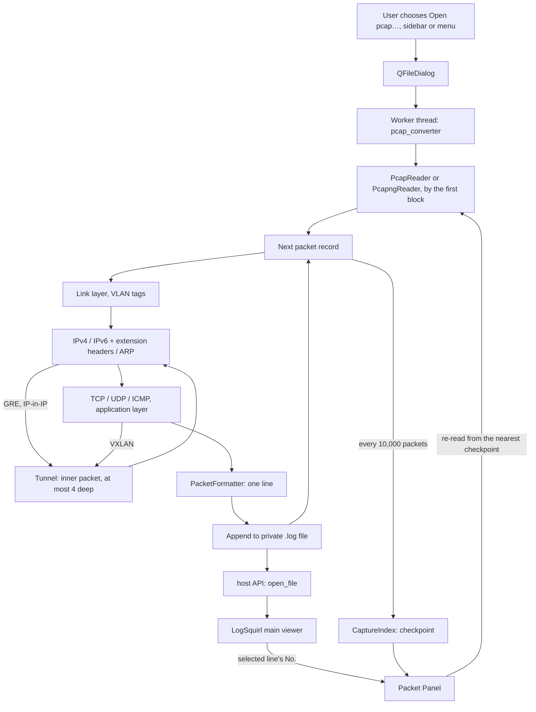

<!-- Allow GitHub's presentation markup and a logo before the main heading. -->
<!-- markdownlint-configure-file {"MD033": {"allowed_elements": ["div", "img"]}, "MD041": false} -->

<div align="center">


# tcpdump / pcap Viewer

**Packet captures you can actually read.**

**A [LogSquirl](https://github.com/64x-lunicorn/LogSquirl) plugin that turns
`.pcap` and `.pcapng` files into a readable packet list.**

Protocol dissection, application-layer detection and stream tracking — rendered
as text, so LogSquirl's regex search and highlighters work on it.

[](https://github.com/64x-lunicorn/LogSquirl-tcpdump/actions/workflows/ci-build.yml)
[](https://github.com/64x-lunicorn/LogSquirl-tcpdump/releases/latest)
[](https://github.com/64x-lunicorn/LogSquirl-tcpdump/releases)
[](#install)
[](LICENSE)

[Install](#install) &nbsp;/&nbsp;
[Usage](#usage) &nbsp;/&nbsp;
[Build](#build) &nbsp;/&nbsp;
[Architecture](#architecture) &nbsp;/&nbsp;
[Changelog](CHANGELOG.md)

</div>

---

## Why this plugin?

You have a capture and a log from the same incident, and they live in two
different tools. This one renders the capture as text in the viewer you already
have the log open in.

| Reads the capture | Shows the story |
| :--- | :--- |
| **pcap and pcapng files.** `.pcap`, `.pcapng`, `.cap`, `.dmp`, both endiannesses, microsecond and nanosecond timestamps, with a text preamble scan for `adb exec-out tcpdump` output. pcapng captures from Wireshark or macOS's `tcpdump -P` may mix interfaces of different link types and timestamp resolutions, and hold several sections. Read packet by packet in the background, so multi-GB captures work and can be cancelled. | **Wireshark-style columns.** No., Stream, UTC Time (`2026-10-09 08:41:12.123456Z`, the packet's wall-clock time in UTC), Time (since the first packet), Source, Destination, Protocol, Length (on the wire), Info — TCP flags in bracket notation, sequence and acknowledgement numbers relative to the start of each direction as in Wireshark (the SYN is `Seq=0`), the window scaled once both SYNs negotiated window scaling, a SYN's options as Wireshark shows them (`MSS=1460 SACK_PERM TSval=… TSecr=0 WS=128`), the handshake's initial round-trip time on the ACK that completes it (`[iRTT=0.012345]`), and Wireshark's TCP analysis markers at the start of Info in its words — `[TCP Retransmission]`, `[TCP Fast Retransmission]`, `[TCP Dup ACK 7#1]`, `[TCP Out-Of-Order]`, `[TCP Window Full]`, `[TCP ZeroWindow]`, `[TCP Keep-Alive]` and more — so highlighters and filters written for Wireshark carry over; a packet cut at the snaplen is marked `[cut to N bytes]`. |
| **Protocol dissection.** IPv4, IPv6 with its extension headers, TCP, UDP, ICMP, ICMPv6 and ARP; IP fragments after the first are shown as such. VXLAN, GRE and IP-in-IP tunnels are unwrapped: a tunnelled packet is shown by the packet inside, its stream keyed by the inner addresses and ports, the tunnel named first in Info (`VXLAN VNI 100 | 50000 → 8080 [SYN] Seq=0 Win=64240`, `GRE | …`, `IPv6-in-IPv4 | …`), at most 4 tunnels deep. ICMP and ICMPv6 in Wireshark's words: echoes with their id and seq (`Echo (ping) request id=0x1234, seq=7`), error messages with their code and the packet they quote (`Destination unreachable (Port unreachable) for 10.0.0.1:51234 → 192.168.1.5:53 UDP`), neighbor discovery with its target, link-layer address and flags. | **Conversations, not packets.** TCP and UDP stream numbers from addresses and ports, so both directions filter together; numbered per transport like Wireshark's `tcp.stream` and `udp.stream`, other packets show `-`. Once a stream's protocol is recognised (TLS, HTTP, …), every later packet of it carries that Protocol label, those in the middle of a body or a record that is not reassembled described as `Continuation`. |
| **Application layers.** TLS records, every one in a segment, with the server name (SNI), version and ALPN of a hello, QUIC packets on UDP with their type, version and connection IDs (short headers known from their connection's long headers), HTTP requests with their host and responses with their content type and length, HTTP/2 (cleartext) by its connection preface and the frames that follow, with their types and streams, DNS queries and responses with their transaction id, query type and answers, over UDP and TCP, DHCP messages with their type, transaction id, client MAC, address and host name (`DHCP Offer - Transaction ID 0x3903f326, 192.168.1.50 for 00:11:22:33:44:55`), DHCPv6 messages with their type and client DUID, NTP packets with their version, mode and stratum (`NTP Version 4, server, stratum 2`), NMEA 0183 sentences, SOCKS4/5 handshakes with their destinations and credentials. A TLS record, an HTTP header section or a DNS-over-TCP message that spans TCP segments is reassembled and described once, on the segment that completes it (`Client Hello, SNI=example.com, TLS 1.3 [reassembled from 3 segments]`), the segments before it as `[TCP segment of a reassembled PDU]`; segments are put in sequence order, retransmissions and overlaps dropped, within bounded memory. | **Payload you can skim.** Printable text shown, other bytes as dots, cut at 200 characters; mostly-binary payloads suppressed. |
| **Link layers and tags.** Ethernet, Raw IP, Linux cooked capture v1 and v2, BSD loopback (DLT_NULL, DLT_LOOP); Wi-Fi (802.11, with or without a Radiotap header), PPP, Cisco HDLC and PPPoE; stacked 802.1Q and QinQ tags stripped transparently. 802.11 management and control frames are named as Wireshark names them, between MAC addresses (`Beacon frame, SN=1000, FN=0, BI=100, SSID="HomeNet"`, `Probe Request`, `Authentication`, `Request-to-send`); data frames reach IP through LLC/SNAP, encrypted ones show as `QoS Data, SN=6, FN=0, Protected`. PPP and PPPoE sessions reach IP; LCP, IPCP, IPv6CP, PAP and CHAP are named with their message (`Configuration Request`, `Echo Reply`, `Authenticate-Request`, no credentials), PPPoE discovery with its stage (`Active Discovery Offer (PADO) AC-Name='isp'`). | **A capture at a glance.** Sidebar panel with protocol breakdown, top endpoints, duration, packets per second, file size and the TCP analysis markers per kind. |

Packets that are not dissected further are named, not numbered: IP protocols
such as IGMP, GRE, ESP, AH, OSPF, PIM, VRRP, L2TP and SCTP, and EtherTypes such
as LLDP, MPLS, 802.1X (EAPOL), PTP and Wake-on-LAN;
an unknown one keeps its number, `IP(200)` or `ETH(0x1234)`. Port-based hints
name about a hundred TCP and UDP services: SSH, FTP, SMTP, IMAP, SNMP, Syslog,
TFTP, STUN/TURN, WireGuard, LLMNR, NBNS, DHCPv6, RTSP, LDAP, SMB, RDP, VNC,
Kerberos, MySQL, PostgreSQL, Redis, MongoDB, MQTT, AMQP, Kafka, ADB and more,
each only on the transport it runs over.

## Install

### From LogSquirl

*Plugins → Browse Plugins…* → **tcpdump / pcap Viewer** → **Install**. The
archive is downloaded, verified against its SHA-256 checksum and loaded — no
file copying.

### From a release

Download the archive for your platform from the
[releases page](https://github.com/64x-lunicorn/LogSquirl-tcpdump/releases/latest)
and unpack it into LogSquirl's plugin directory:

| Platform | Plugin Directory |
|----------|-----------------|
| macOS    | `~/Library/Application Support/logsquirl/plugins/io.github.logsquirl.tcpdump/` |
| Linux    | `~/.local/share/logsquirl/plugins/io.github.logsquirl.tcpdump/` |
| Windows  | `%APPDATA%/logsquirl/plugins/io.github.logsquirl.tcpdump/` |

The archive also holds, next to the library, `tcpdump_log.json`, the
[Log Format](#log-format) for the converted packet list, and
`tcpdump_highlighter.conf` and `tcpdump_filter.conf`, the [highlighter set
and filter group](#highlighters-and-filters). LogSquirl loads none of them
from there: copy the Log Format into its formats directory and import the
other two, as described below.

### From source

See [Build](#build), then:

```bash
DEST="$HOME/Library/Application Support/logsquirl/plugins/io.github.logsquirl.tcpdump"
mkdir -p "$DEST"
cp build/liblogsquirl_tcpdump.dylib "$DEST/"
cp plugin.json icon.png "$DEST/"
```

and copy the [Log Format](#log-format) into LogSquirl's formats directory.

After installing, restart LogSquirl or re-scan via *Plugins → Manage Plugins…*.

## Usage

1. Open LogSquirl
2. In the sidebar, select the **tcpdump** tab
3. Click **Open pcap…** and select a `.pcap`, `.pcapng`, `.cap`, or `.dmp` file. The
   same dialog opens from **Plugins → tcpdump → Open pcap…**, and so from
   the Command Palette (`Ctrl+Shift+P`, `Cmd+Shift+P` on macOS); while a
   capture is being read, it only says so
4. The parsed packets will open as a text log in LogSquirl's viewer. A
   progress bar shows how far a large capture is read; **Cancel** stops it
5. The text is written to a new file in a private temporary directory,
   readable by you only, and removed when LogSquirl quits
6. The sidebar shows the summary of the capture in the tab in front:
   switching tabs switches it, and a tab that is not a converted capture
   shows none. Under *Analysis* it gives the median initial round-trip time
   (iRTT) of the TCP handshakes captured whole, and the segments per TCP
   analysis marker
7. Use LogSquirl's built-in search, filters, and highlighters on the
   packet data; the plugin's [highlighter set and filter
   group](#highlighters-and-filters) colour and filter it as Wireshark does
8. To follow a conversation, as Wireshark's *Follow TCP Stream* does, select
   one of its packet lines and click **Follow stream** in the sidebar, or
   choose **Plugins → tcpdump → Follow stream**. LogSquirl's Regex Lab opens
   with a pattern that matches that TCP or UDP stream's lines: its number in
   the Stream column, its two addresses and its two ports, in either
   direction (TCP and UDP streams are numbered each on their own). Apply it,
   and the filtered view shows the conversation alone. A line without a
   stream (`-` or `?`), no selection, or a line of another log only shows a
   notification saying why. Needs LogSquirl ≥ 26.11
9. To filter by an endpoint or a protocol, as Wireshark's *Apply as Filter*
   from its statistics, click it in the sidebar summary: the Regex Lab opens
   with a pattern that matches the lines with that address in the Source or
   Destination column, or that name in the Protocol column (not where either
   only appears in Info). Apply it to filter the view. The endpoints of
   tunnels, listed apart under *Tunnel endpoints*, are no links: a
   tunnelled packet's line shows the packet inside, so their addresses are
   in no column. Needs LogSquirl ≥ 26.11; on an older one the summary lists
   the endpoints and protocols as plain text
10. To look into a packet, as Wireshark's lower panes do, select its line:
   the **Packet** panel below the sidebar summary shows its layers as a
   tree (Frame, Ethernet, IP, TCP/UDP/ICMP, tunnels, the application
   protocol the payload was recognised as) with every field named, and its
   bytes as a hex and ASCII dump; selecting a layer or field highlights its
   bytes. The panel follows the selection while the tcpdump tab is in view
   (it asks LogSquirl at most every 250 ms, and not at all while hidden),
   and **Plugins → tcpdump → Packet details** shows the selected line's
   packet at once. The packet is read again from the capture file, found
   by the line's No.: the plugin keeps a file position every 10,000 packets
   while converting, so no packet is kept in memory. A capture file that
   was changed, moved or removed after it was opened is reported, not
   misread; open it again. Needs LogSquirl ≥ 26.11
11. With the [Log Format](#log-format) installed, switch to the table view
   with the toolbar's table button

### Options

**Plugins → Plugin Management…**, **Configure…** on the plugin's card,
opens its options:

| Option | Default | Choices |
|--------|---------|---------|
| Time | UTC time and time since the first packet | UTC time only; time since the first packet only |
| Show MAC addresses as columns | off | `Source MAC` and `Destination MAC` before Info, `-` for a packet that is not on Ethernet or Wi-Fi |
| Preview payloads no protocol is recognised in | on, 200 characters | off; 1 to 200 characters |
| Show TCP timestamps (TSval, TSecr) on every segment | off: on SYNs only, among their options | on: every segment with the option, as Wireshark shows it |
| Streams numbered at most (Advanced) | 1,000,000 | 1 to 10,000,000; later streams show `?` |
| Endpoints counted at most (Advanced) | 100,000 | 1 to 1,000,000; the rest count as other endpoints |
| TCP reassembly memory at most (Advanced) | 64 MB | 1 to 1,024 MB, all streams together, at most 64 KB a stream direction; a message that does not fit keeps its per-segment description, followed by `[reassembly limit]` |

They are kept in `settings.ini` in the plugin's configuration directory
(`plugin_config/io.github.logsquirl.tcpdump` beside LogSquirl's plugin
directory) and read when a capture is opened: a capture already open keeps
the options it was converted with; open it again to apply new ones.

The defaults write the packet list shown under [Example Output](#example-output),
which the Log Format and every highlighter and filter written for it expect.
The plugin's own patterns, those of [Follow stream](#usage), the summary's
filters and the [highlighter set and filter group](#highlighters-and-filters),
read every layout. Two options change the column layout:

- **Time**: a line has one time column fewer. The [Log Format](#log-format)
  still reads it, leaving the missing column empty: with the UTC time only,
  `time` is empty; with the time since the first packet only, `timestamp`
  is empty, so the line has no timestamp, and Δt, Go to timestamp, time
  ranges and the Chart Panel's rates are lost. A highlighter or filter
  that counts columns, or expects a time where the other one was, no
  longer matches.
- **Show MAC addresses as columns**: the two MAC columns come right before
  Info, so the Log Format reads them as the start of `body`; the other
  columns stay where they are. A highlighter or filter anchored at the
  start of Info no longer matches.

The payload preview, the TCP timestamps and the caps change only what Info says or which
streams are numbered, not the columns.

### Log Format

LogSquirl recognises the packet list as a log with fields once it has the
plugin's Log Format definition, [`formats/tcpdump_log.json`](formats/tcpdump_log.json)
(lnav-compatible, like LogSquirl's built-in formats). It is a one-time copy:

1. Take `tcpdump_log.json` from the release archive (it lies next to the
   library), or from the [`formats`](formats/) folder of this repository
2. In LogSquirl, open **Options → Log Formats**, click **Open Formats
   Folder…** and copy the file there. The folder is

   | Platform | Formats Directory |
   |----------|-------------------|
   | macOS    | `~/Library/Application Support/logsquirl/formats/` |
   | Linux    | `~/.local/share/logsquirl/formats/` |
   | Windows  | `%APPDATA%/logsquirl/formats/` |

   (a portable LogSquirl uses the `formats` folder beside its executable)
3. Turn on **Auto-detect log format (table view)** on the same tab and click
   **OK**; formats are read again when the Options dialog is applied. A
   capture opened before keeps its format: open it again

A converted capture then gets:

- **Table View**: one column per field — `number`, `stream`, `timestamp`
  (the UTC Time), `time` (since the first packet), `source`,
  `destination`, `protocol`, `length` and `body` (the Info column)
- **Δt**: the time since the previous packet, right after the timestamp
- **Go to timestamp** (`Ctrl+Shift+L`) and **Set search limits to time
  range…**: the UTC Time is read with `%Y-%m-%d %H:%M:%S.%f%z`, at 6 or 9
  decimals (LogSquirl keeps milliseconds); type times in UTC, as the
  column shows them
- **Chart Panel templates**: *Message Rate* is packets per second (or per
  5 s, 10 s, minute), and *Numeric Fields* plots `length`, the bytes on
  the wire, over time
- **Export as CSV** from the table, one column per field

The sidebar summary links here once per session, since the plugin cannot
tell whether the format is installed.

### Highlighters and filters

Two files in the [`presets`](presets/) folder colour and filter the packet
list much as Wireshark's default colouring rules and display filters do. Get
them from the release archive, where they lie next to the library, or from
this repository, and import each once:

- **Highlighter set** [`tcpdump_highlighter.conf`](presets/tcpdump_highlighter.conf):
  **Highlighters → Configure highlighters…**, *Import*, **OK**, then switch
  the set *tcpdump* on in the **Highlighters** menu
- **Filter group** [`tcpdump_filter.conf`](presets/tcpdump_filter.conf):
  **Tools → Predefined filters…**, *Import*, **OK**; the filters of the group
  *tcpdump* are then listed in the Filters tab of the Filters Panel, where
  checking one filters the view

Importing a newer version of a file offers to replace the one imported
before. The highlighters, the first that matches a line colouring it:

| Highlighter   | Colours the lines of                                                                  | Colour       |
|---------------|---------------------------------------------------------------------------------------|--------------|
| TCP problems  | TCP analysis markers but Window Update and Keep-Alive (`[TCP Retransmission]`, `[TCP Dup ACK 7#1]`, `[TCP Window Full]`, `[TCP ZeroWindow]`, …) and a bogus TCP header length | orange |
| TCP RST       | TCP segments with RST                                                                 | strong red   |
| ICMP errors   | ICMP destination unreachable, source quench, redirect, time exceeded; ICMPv6 destination unreachable, packet too big, time exceeded, parameter problem | orange |
| DNS NXDOMAIN  | DNS and mDNS responses for a name that does not exist (`[NXDOMAIN]`)                  | red          |
| HTTP 4xx/5xx  | HTTP responses with a client or server error status                                   | red          |
| TCP SYN/FIN   | TCP segments with SYN or FIN: connections opened and closed                           | green        |
| TLS           | Protocol TLS                                                                          | blue         |
| ARP           | Protocol ARP                                                                          | grey         |

The filters:

| Filter          | Shows the lines of                                                       |
|-----------------|--------------------------------------------------------------------------|
| TCP handshakes  | TCP segments with SYN or FIN                                             |
| TCP errors      | what the *TCP problems* and *TCP RST* highlighters colour                |
| DNS             | Protocol DNS or mDNS                                                     |
| HTTP            | HTTP requests and responses (Protocol HTTP…, Info naming a request line or status line) |
| TLS             | Protocol TLS                                                             |
| ICMP            | Protocol ICMP or ICMPv6                                                  |
| ARP             | Protocol ARP                                                             |

Each pattern reads the columns, so it never matches a word that only
appears in Info's payload text: a Protocol is read from the Protocol
column, TCP flags from the bracket right after the ports, an HTTP status
or a DNS response code from the description after the first ` | `. A
tunnelled packet is matched by the packet inside: the tunnels Info names
first (`VXLAN VNI 100 | `, `GRE | `, …) are skipped. They match in every
choice of [columns](#options).

## Example Output

```
No.    Stream  UTC Time                     Time           Source                                  Destination                             Protocol  Length Info
1      0       2026-10-09 08:41:12.123456Z  0.000000       192.168.1.100                           10.0.0.1                                TCP       54     443 → 54321 [SYN] Seq=0 Win=65535
2      0       2026-10-09 08:41:12.123956Z  0.000500       10.0.0.1                                192.168.1.100                           TCP       54     54321 → 443 [SYN, ACK] Seq=0 Ack=1 Win=65535
3      0       2026-10-09 08:41:12.124456Z  0.001000       192.168.1.100                           10.0.0.1                                TCP       54     443 → 54321 [ACK] Seq=1 Ack=1 Win=65535
4      0       2026-10-09 08:41:12.173456Z  0.050000       192.168.1.100                           10.0.0.1                                DNS       72     53 → 12345 Len=34
5      -       2026-10-09 08:41:12.223456Z  0.100000       192.168.1.100                           10.0.0.1                                ICMP      74     Echo (ping) request id=0x0001, seq=1
6      0       2026-10-09 08:41:12.243456Z  0.120000       10.0.0.1                                192.168.1.100                           TCP       1514   54321 → 443 [ACK] Seq=1 Ack=1 Win=65535 Len=1460 [cut to 96 bytes]
7      0       2026-10-09 08:41:12.243956Z  0.120500       192.168.1.100                           10.0.0.1                                TCP       54     443 → 54321 [ACK] Seq=1 Ack=1461 Win=65535
8      0       2026-10-09 08:41:12.244456Z  0.121000       192.168.1.100                           10.0.0.1                                TCP       54     [TCP Dup ACK 7#1] 443 → 54321 [ACK] Seq=1 Ack=1461 Win=65535
```

## Prerequisites

- **LogSquirl** ≥ 26.03 with the plugin system enabled; features that use the
  Regex Lab, *Go to line* or the selected log lines need LogSquirl ≥ 26.11 and
  are not offered on an older one
- **Qt6** (Core, Concurrent, Widgets) — same version LogSquirl was built with
- **CMake** ≥ 3.16
- A C++17-capable compiler (GCC ≥ 9, Clang ≥ 14, MSVC ≥ 19.29)

## Build

```bash
# Clone
git clone https://github.com/64x-lunicorn/LogSquirl-tcpdump.git
cd LogSquirl-tcpdump

# Configure
cmake -B build -S . -DCMAKE_BUILD_TYPE=Release

# If Qt6 is not in PATH (e.g. Homebrew on macOS):
cmake -B build -S . -DCMAKE_BUILD_TYPE=Release \
  -DCMAKE_PREFIX_PATH="$(brew --prefix qt6)"

# Build
cmake --build build

# The shared library is in build/:
#   macOS:   build/liblogsquirl_tcpdump.dylib
#   Linux:   build/liblogsquirl_tcpdump.so
#   Windows: build/logsquirl_tcpdump.dll
```

### Running Tests

```bash
cmake -B build -S . -DCMAKE_BUILD_TYPE=Release -DBUILD_TESTS=ON
cmake --build build
cd build && ctest --output-on-failure
```

## Architecture


```mermaid
graph TD
    A[User chooses Open pcap…, sidebar or menu] --> B[QFileDialog]
    B --> C[Worker thread: pcap_converter]
    C --> D[PcapReader or PcapngReader, by the first block]
    D --> E[Next packet record]
    E --> F[Link layer, VLAN tags]
    F --> G[IPv4 / IPv6 + extension headers / ARP]
    G --> H[TCP / UDP / ICMP, application layer]
    G -->|GRE, IP-in-IP| T[Tunnel: inner packet, at most 4 deep]
    H -->|VXLAN| T
    T --> G
    H --> I[PacketFormatter: one line]
    I --> J[Append to private .log file]
    J --> E
    J --> K[host API: open_file]
    K --> L[LogSquirl main viewer]
    E -->|every 10,000 packets| X[CaptureIndex: checkpoint]
    L -->|selected line's No.| P[Packet Panel]
    X --> P
    P -->|re-read from the nearest checkpoint| D
```

## License

GPL-3.0-or-later — see [LICENSE](LICENSE) for the full license text.

The vendored `include/logsquirl_plugin_api.h` header is MIT-licensed, so
plugins of any license can build against the LogSquirl Plugin SDK without
taking on GPL obligations. See [NOTICE](NOTICE) for details.
